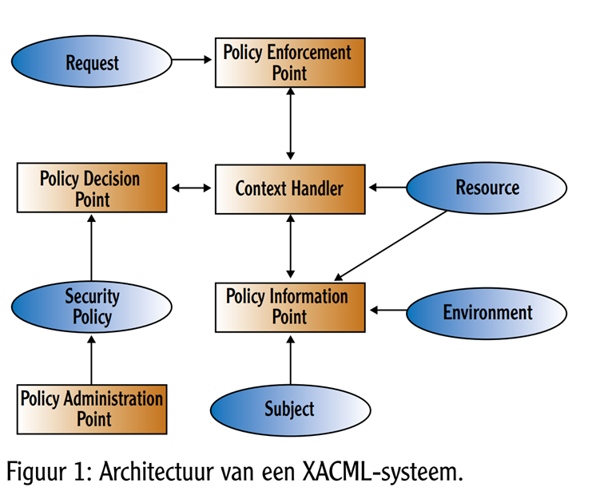

<a href="https://www.oasis-open.org/committees/tc_home.php?wg_abbrev=xacml" target="_blank">OASIS
Committee XACML</a>, the eXtensible Access Control Markup Language; een taal voor het uitdrukken van
regels voor toegangsverlening. Deze regels zijn technologie onafhankelijk en gescheiden van de
gegevens waarop ze betrekking hebben. De taal ondersteunt Attribute Based Access Control (ABAC).

Zie ook <a href="https://biplatform.nl/magazines/Aveq/118852.pdf" target="_blank">Artikel Java
Magazine mei 2011</a>
