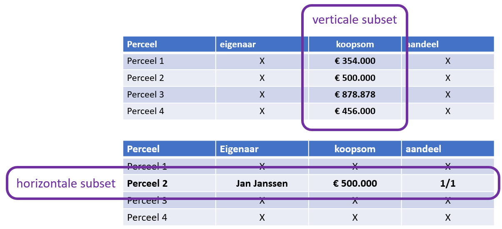
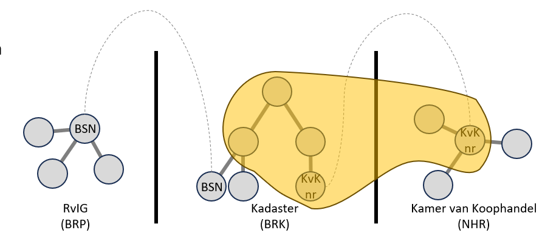
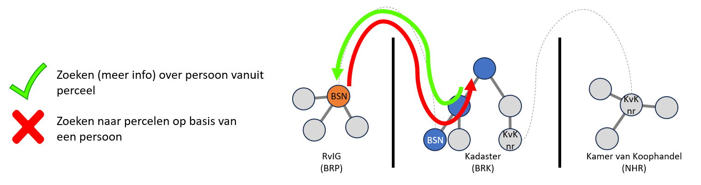

Zoals in het vorige hoofdstuk als is gesteld, willen we graag een [federatieve
bevraging](../federatieve-bevraging/index.md) doen. Dat betekent een query over meerdere silo's en
dus meerdere endpoints. Zie ook [informatiekundige
kern](../federatieve-bevraging/informatiekundigekern.md),
[testopstelling#silos](../federatieve-bevraging/testopstelling.md#silos) en
[informatiemodel](../federatieve-bevraging/informatiemodel.md). 

Omdat deze databronnen gevoelige informatie bevatten, moet autorisatie op deze gegevenssets worden toegepast. Wie toegang heeft tot informatie (en tot hoeveel informatie) hangt af van de context. Gegevens kunnen bijvoorbeeld niet openbaar beschikbaar zijn op basis van beleid en wetten die verband houden met de bescherming van persoonsgegevens of om commerciële redenen, zoals gevoelige informatie die verband houdt met bedrijfsprocessen. Zelfs binnen deze contexten kunnen bepaalde rollen meer toegang krijgen tot informatie dan andere rollen en alleen voor bepaalde doeleinden.

Als we informatie (data, gegevens) willen afschermen en daar onder voorwaarden toegang toe willen
verlenen ([autorisatie](autorisatie.md)) kunnen we een aantal afschermingspatronen onderkennen.
Patronen van hoe informatie georganiseerd is of we daarin afscherming zouden willen afdwingen.

Voor de flexibiliteit van het gebruik en hergebruik van data is per gebruik vrij kunnen bevragen (query’n) of navigeren door het datastelsel zeer gewenst / noodzakelijk. Het doel is om **vrije bevraging** (query) te ondersteunen onder de voorwaarden die dmv
autorisatie is toegestaan.

Welke beperkingen zijn daarin vanuit die voorwaarden en autorisatie dan gewenst? Dit zijn
requirements die gesteld worden aan de autorisatie oplossing.

## Toegang tot een Subset

'**Data partioning**' is een concept dat bij databasebeheer wordt gebruikt om grote datasets in
kleinere, beter beheersbare partities of subsets te verdelen. Dit kan zowel **verticaal** als
**horizontaal** gedaan worden. Op deze kleinere subsets kunnen toegangscontrole mechanismen
toegepast worden.

|  |
| :--: |
| Subset Requirement |

In Linked Data kan een subset ook subgraph genoemd worden (zie
[glossary](../achtergrond/glossary.md)). Bovenstaande concept is dan ook voor Linked Data van
toepassing. Het is mogelijk om horizontale of verticale sub-graphs te maken. Een horizontale
sub-graph bevat dan niet alle triples maar een selectie van bijvoorbeeld een specifieke regio. Een
verticale sub-graph bevat alleen de triples die een specifiek attribuut betreffen van een subject en
niet alle triples van dat subject.

|  |
| :--: |
| Subgraph Requirement | 

## Toegang tot Data in een Bepaalde Richting

Een van de intrinsieke kwaliteiten van graphs is om op verkennende wijze door de graph te navigeren.
Binnen de context van een federatief datastelsel bestaan er echter een aantal gebruiksscenario's
waarin deze vrije navigatie niet gewenst is en (dus) beperkt moet worden.

Een van de noodzakelijke beperkingen in deze context is de mogelijkheid om inverse queries uit te
voeren. Met andere woorden, het is noodzakelijk om toegangscontroles op gegevens te implementeren
waarbij het opvragen van informatie in een bepaalde richting van de graph mogelijk is, maar het
opvragen van de omgekeerde richting niet mogelijk is.

> Bijvoorbeeld: het zou mogelijk moeten zijn om te zoeken naar de eigenaar van een specifiek perceel
> op basis van het perceelnummer maar niet alle perceelnummers die iemand in eigendom heeft op basis
> van naam/BSN. 

|  |
| :--: |
| Query Direction | 
