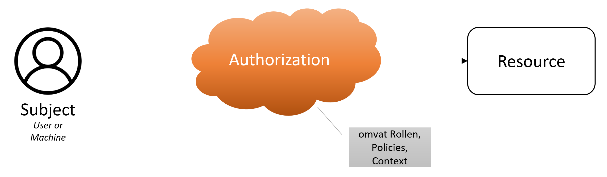

In beginsel is autorisatie eenvoudig: iemand wil bij iets en de vraag is of dat mag.

|  |
| :--: |
| Authorisatie op zijn basis |

Was het maar zo gemakkelijk.

- _‘iemand’_ betekent dat bekend moet zijn wie diegene is. Dit vraagt om identificatie,
  identificerende gegevens, identiteiten. Het proces om dit te verifiëren heet authenticatie en dat
  is een onderwerp op zich. 
- Het _‘iets’_ betekent ‘een resource’. Dat kan een hele dataset zijn, bijv. een basisregistratie
  als BAG, BGT of BRK. Het kan ook een specifieke selectie zijn uit een dataset of een selectie uit
  de combinatie van meerdere datasets. Dat _‘iets’_ is al snel complex.
  
Veel gehanteerde termen zijn _‘subject’_ voor _‘de iemand die de vraag stelt'_. _‘Resource’_ wordt
gebruikt voor het _‘iets dat opgevraagd wordt’_. De autorisatie wordt bepaald door _‘policies’_, de
voorwaarden, waaronder het subject toegang krijgt of niet. Deze gaan uit van een _‘context’_ waarin
de _‘rollen’_ van het _‘subject’_ en extra informatie op basis van het _‘request’_, de vraag, kunnen
worden meegenomen in de afweging. Deze terminologie is formeel vastgelegd in
[XACML](../achtergrond/xacml.md). 

## Subject

Een **subject** kan een gebruiker zijn en ook een machine (computer). Afhankelijk van het type bestaan
er verschillende soorten van identiteiten.

|  |
| :--: |
| Subject |

Gebruikers worden meestal beheerd in een ‘User Management System’, welke weer gevoed kan worden door
een HR systeem. Daarin worden meestal ook functies en rollen bijgehouden en uitgegeven door de
beheerorganisatie over wat ‘iemand mag’. Een gebruiker heeft dan een ‘username’ (en wachtwoord) en
een set aan rollen. Een geautoriseerd persoon geeft toestemming en legt verantwoording af over de
rechten (rollen) van een gebruiker.

Machines worden vaak dmv certificaten of (API) ‘keys’ (sleutels) geïdentificeerd. Deze zijn
uitgegeven door een autoriteit en zijn geautomatiseerd te controleren.

Zowel gebruikersaccounts als sleutelbeheer zijn complexe beheersprocessen waarin vele lagen van
(verborgen) complexiteit zitten, zoals het kunnen intrekken, delegeren, verschillende niveaus van
vertrouwen passend bij de verschillende niveaus van betrouwbaarheid die nodig is, etc, etc.

<b>Out of scope</b> 
Voor het Lock-Unlock project hebben we het onderdeel 'Subject' en ook het proces van authenticatie
aangenomen als beschikbaar. Dat is er. Dat bestaat gewoon. Dit is absoluut niet het geval en er
valt juist heel veel over te zeggen. Maar voor de scope van dit project is dat niet relevant. Op
enig manier wordt een user of machine geïndentificeerd en dat vindt plaats <i>vóórdat</i> het onderdeel
autorisatie komt. Dit laatste is juist het onderwerp van onderzoek voor Lock-Unlock.

## Authorisatie

Autorisatie is de controle en het proces van toegang geven tot een Resource. Een subject krijgt vaak niet zomaar toegang tot een resource. Het doel van
autorisatie is dat alleen vastgestelde toegang verleend wordt aan Subjecten. Dat is een proces van
afscherming _vóóraf_. Dit is het onderwerp van onderzoek voor het Lock-Unlock project en komt nog
uitgebreid aan bod.

Het doel van autorisatie, zeker in de context van de overheid, is te garanderen dat deze toegang
rechtmatig is. Dat wil zeggen dat er een **juridische grondslag** is voor de toegang en/of
verwerking. Het blijkt echter onmogelijk om _volledig_ van tevoren te kunnen bepalen of de grondslag
voldoende is om toegang te kunnen verlenen. Dat heeft met name te maken met de gedeelde
verantwoordelijkheid van die toegang als dat een koppeling tussen twee organisaties betreft. De
enige mogelijkheid om de grondslag juist te kunnen controleren, is _achteraf_. In dat geval is
[auditing](#auditing) nodig op de toegang die gegeven is. Voorkomen is dan helaas niet meer
mogelijk, maar wel bijsturing en eventueel opvolging.

Bij het uitdelen van autorisaties wordt o.a. gekeken naar interne en externe beleidstukken en wet- en regelgeving. Een belangrijk aspect hierbij is de doelbinding, zeker als het om persoonsgegevens gaat: gegevens mogen alleen worden verwerkt en verzameld voor een specifiek en gerechtvaardigd doel.

|  |
| :--: |
| Doelbinding |

Dit is niet gemakkelijk te controleren. Het punt is namelijk dat die doelbinding per casus gebonden zou moeten worden, maar informatie vaak over organisatiegrenzen heen gedeeld en gebruikt wordt. Het is voor de ene organisatie niet mogelijk om te beoordelen of de specifieke casus waar de betreffende gebruiker van de andere organisatie mee bezig is, passend is voor het doel dat beoogd is. Vooraf specifieke doelbinding controleren is daarom niet (volledig) mogelijk. Daar komt bij dat doelbinding op dit moment niet “machine readable” is en de relatie met het datamodel is niet formeel is vastgelegd. Hierdoor is het (ook) niet mogelijk om een koppeling te leggen tussen de doelbinding en de bijbehorende attributen en queries.

In geval van toegang verlenen, oftewel autorisatie, wordt wel vaak een afgeleide gemaakt van de doelbinding op een hoger niveau dan specifieke casussen. Een hele organisatie heeft toegang tot de gehele dataset van een andere organisatie. Door gestandaardiseerd te loggen wat precies wordt opgevraagd door wie, is wel specifieke controle achteraf mogelijk. De [GEMMA Verwerkingenlogging](../achtergrond/verwerkingenlogging.md) is hier de standaard (in ontwikkeling) voor.

## Auditing

Zoals hierboven al gesteld, is het onmogelijk om van tevoren of bij de evaluatie om toegang te gaan
verlenen te bepalen of dat rechtmatig is. Dat is vooral in het geval als het een koppeling tussen
twee (of meer) organisaties betreft. De medewerker van de bevragende organisatie zal een juridische
grondslag moeten hebben om de bevraging te kunnen doen. Het is echter niet mogelijk voor de
leverende organisatie om te bepalen of die grondslag juist is en passend voor de situatie. Sterker
nog, het is onrechtmatig als de leverende organisatie precies weet voor welke casus de bevraging
wordt gedaan. Dat betekent dat er van tevoren afspraken gemaakt kunnen worden of de mogelijkheid dat
(medewerkers van) een organisatie de API van een andere organisatie gaan aanroepen en dát kan
gecontroleerd worden ten tijde van de bevraging. Dit is wat we autorisatie noemen. Voor de controle
op juiste grondslag per bevraging zijn we aangewezen op auditing.

Voor de auditing zijn beide partijen nodig en verantwoordelijk. De partij / organisatie van waaruit
de bevraging wordt gedaan, is verantwoordelijk voor het vastleggen van de relatie naar de specifieke
grondslag en specifieke casus waarvoor die grondslag zou moeten gelden en de medewerker die vanuit
die organisatie daarbij betrokken is. De partij / organisatie die bevraagd wordt, de leverende
partij, dient vast te leggen dat zij bevraagd zijn door de vragende partij en voor welke resource
dat precies was. Om dmv een audit de relatie tussen beide verslaglegging te kunnen doen, wordt er
vanuit de bevragende partij een `transaction referentie` (of `id`) meegegeven die in beide
verslagleggingen dient te worden bewaard. Deze verslaglegging wordt ook wel 'logging' genoemd.

Er bestaat een standaard in wording voor dit patroon en toepassing:
[Verwerkingenlogging](../achtergrond/verwerkingenlogging.md)

## Resource

Bij een **‘resource’** denken we in eerst instantie al snel aan een ‘tabel’. Een set aan gegevens van rijen en kolommen. 

|  |
| :--: |
| Resource |

Was het maar zo eenvoudig... Meestal is een 'set of data’, een verzameling tabellen. In veel gevallen is er een volledige informatiemodel (IM) of datamodel ontworpen om alle relaties tussen deze tabellen nauwkeurig en volledig weer te geven. De verschillende objecten in het model hebben elk hun eigen tabel en worden in de tabel impliciet gedefinieerd door sleutelkolommen. Zo'n hele verzameling gerelateerde objecten en een set gegevens wordt een dataset genoemd. 
Voorbeelden: de basisregistraties zoals BRK, BAG, BGT.

_In deze context is een resource een database die een of meer tabellen bevat._

### Resource: Tabel, Dataset, Database

Een tabel of een dataset zit meestal in een database. 

|  |
| :--: |
| Resource - Database |

Goed gebruik is om deze niet direct toegankelijk te maken voor gebruikers, maar te voorzien van een [Application Programming Interface (API)](../federatieve-bevraging/apis.md). Een API is een technisch koppelvlak die mogelijkheden biedt voor het opvragen (en muteren) van data en daar ook controles en beperkingen aan kan stellen. Hoewel API een generiek concept is, wordt in de huidige staat van de technologie meestal een ‘REST API’ bedoeld.

Een API kan bijvoorbeeld een beperkt deel van de data(base) beschikbaar maken. Hierin is een verschil tussen horizontale en verticale scheiding (segmentatie). Horizontale scheiding betekent dat niet alle rijen op te vragen zijn. In het kader van autorisatie zou dat bijvoorbeeld beperkt kunnen zijn tot een bepaalde regio, bijvoorbeeld gemeentelijke grenzen. 
Een verticale scheiding betekent dat niet alle kolommen op te vragen zijn. Een voorbeeld hiervan is dat perceelinformatie als open data beschikbaar is, maar de persoonsgegevens (uiteraard) niet. Deze zijn alleen op te vragen met de juiste rechten, of eigenlijk: de juiste grondslag. In deze context is de resource de combinatie van database en (REST) API. 

### Resource: Triples

Een resource kan een ingewikkeld informatiemodel hebben en het wordt nog ingewikkelder als meerdere datasets gecombineerd moeten worden. Dat betekent dat er relaties tussen meerdere informatiemodellen moeten worden gelegd. 

|  |
| :--: |
| Database to triples |

[**Linked Data**](../federatieve-bevraging/linkeddata.md) is een concept en technologie die hier veel flexibiliteit en expliciete ondersteuning voor biedt. In plaats van tabellen wordt hierin de data ‘uit elkaar gehaald’ tot zogenaamde **‘triples’**. Elke data instantie is een ‘subject’ dat een relatie heeft (‘predicate’) tot een ‘object’. En dit kan oneindig! Zo kunnen relaties leiden tot een object die attributen beschrijft zoals in een meer traditioneel informatiemodel en een tabel in een database.

In deze context wordt een triple als een resource beschouwd.

|  |
| :--: |
| Resource - Triple |

> **Let Op:** een resource wordt in de terminologie van Linked Data anders gedefinieerd dan in de context van dit rapport. [Zie de Linked Data beschrijving voor meer informatie](../federatieve-bevraging/linkeddata.md). In de context van deze documentatie wordt niet de definitie van resource zoals gedefinieerd in Linked Data gebruikt.

Het _object_ in de ene triple kan het _subject_ worden in een ander, waarbij het predicate dit subject aan een ander object koppelt of een attribuut van dit subject beschrijft. Wanneer twee of meer triples met elkaar verbonden zijn, resulteert dit in een ‘graph’ (graaf). Op deze manier kunnen triples informatie/data met elkaar verbinden, ook wanneer deze oorspronkelijk in verschillende tabellen stonden. De graph die zo ontstaat, kan gebruikt worden om te ‘navigeren’ van _subject_ naar _object_ naar _subject_ naar _object_.

### Resource: SPARQL Endpoint

Een graph wordt opgeslagen in een specifieke database, namelijk een ‘triple store’. Ook deze wordt niet direct ontsloten voor gebruikers, maar beveiligd en afgeschermd door een API. Voor Linked Data is een ‘SPARQL API’ of ‘SPARQL endpoint’ een veelgebruikte API. SPARQL is een ‘query language’, een vraagtaal voor Linked Data obv internet technologie (oa HTTP).

_In deze context is de resource de graph en het bijbehorende SPARQL API / endpoint._

|  |
| :--: |
| Resource - SPARQL Endpoint |

Een bijzondere toegevoegde waarde van het publiceren van data als Linked Data is het federatief kunnen bevragen van data. Datasets zijn vrijwel altijd opgeslagen in silo’s.  Mbv Linked Data kunnen datasets gemakkelijk aan elkaar gerelateerd worden en op een federatieve manier in één keer bevraagd worden. De Kadaster Knowledge Graph is hier een voorbeeld van met de BRK, BGT, BRT en BAG gekoppelde datasets.

De koppeling van elke graph (of resource) vereist de opname van een gedeeld identificerend sleutelveld of attribuut (zie [informatiekundige kern](../federatieve-bevraging/informatiekundigekern.md)). In onderstaande figuur zijn deze attributen of sleutelvelden gedefinieerd als een BSN- of KvK-nummer waarmee drie verschillende graphs met elkaar in verband kunnen worden gebracht. Met behulp van deze velden kan één enkele query worden geschreven, verwijzend naar elke SPARQL API en het relevante sleutelveld, om zo de benodigde informatie uit drie bronnen op te halen.

In deze context is de resource - elke triple, een hele dataset, de gekoppelde datasets, wellicht een selectie uit een dataset - de resource is hier niet eenduidig.

|  |
| :--: |
| Resource - SPARQL Endpoints |

Een resource is dus nog niet zo eenvoudig. Er is hier ook een gelaagdheid in te beschrijven. 
Het meest elementaire onderdeel is een triple. Gerelateerde triples vormen een graph voor een subset van gerelateerde gegevens, traditioneel vaak een object of tabel genoemd. Alle triples en graphs binnen één context vormen een dataset. Zo’n dataset is ontsloten met een bijbehorende API, wat deze in een silo plaatst. Wanneer een dataset relaties naar andere datasets bevat, kunnen refereerde datasets via hun eigen API bevraagd worden. Een selectie uit één dataset wordt een subset genoemd. Gerelateerde selecties over meerdere datasets heen wordt ook subset genoemd en soms superset.

In het kader van het afschermen van gegevens en het autoriseren van de juiste mensen (en machines) met de juiste rechten om deze afgeschermde gegevens juist wél op te vragen, is deze gelaagdheid van belang. Afscherming en autorisatie in de technologie van nu, voornamelijk REST API’s, is binair: je hebt toegang of je hebt het niet. En dat is dan voor de gehele API. Om toch onderscheid en variaties te kunnen doen, worden meerdere API’s gepubliceerd voor specifieke doeleinden of doelgroepen.

|  |
| :--: |
| Resource - Samenvatting |

Met SPARQL API’s is het mogelijk om vrije queries (vragen) te stellen per dataset/-silo of over datasets heen. Autorisaties en variaties in doelgroepen is hierin echter veel ingewikkelder. Dit is precies het onderwerp van dit project.

> _Zie ook de [glossary](../achtergrond/glossary.md) voor de verschillen tussen dataset, subset, database, graph en subgraph_

In de volgende sectie worden enkele van de bestaande implementaties van autorisatie voor federatieve eindpunten besproken. Deze zijn niet exhaustive, maar geven een indicatie van de huidige benaderingen.

