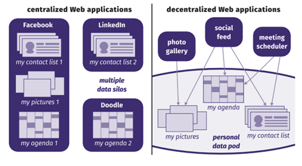

Een van de onderdelen van het desk research was de beoordeling van bestaande oplossingen voor toegangscontrole voor Linked Data bronnen. De lijst van implementaties is niet uitputtend, maar geeft wel een beeld van welke implementaties we zijn tegengekomen. 

In de volgende secties zullen deze implementaties worden besproken en wordt ingegaan op de kansen en uitdagingen voor dit project.

Hierbij komen de volgende implementaties aan bod:

- PoC Topsector Logistiek & iSHARE
- Personal Health Train (FAIR Data Train)
- Nuts Bolt voor KIK-V
- Solid Project
- GEMMA verwerkingenlogging

## PoC Topsector Logistiek & iShare

### Probleem Context
In de logistieke sector bestaat er een keten van stakeholders die allemaal toegang nodig hebben tot informatie over een bepaald project. Deze informatie is vaak gevoelig, vooral in het kader van concurrentie. Daarnaast heeft de overheid verantwoordelijkheden waarvoor ook data nodig is, maar dat betekent  niet toegang tot de volledige dataset(s). Het is dus belangrijk om ervoor te zorgen dat verschillende belanghebbenden op verschillende tijdstippen toegang hebben tot verschillende subsets van informatie. Door de verschillende belangen zijn verschillende oplossingsrichtingen mogelijk en als Proof-of-Concept uitgewerkt.

### Oplossing
Voor de PoC zijn twee aanpakken voor autorisatie getest. Eén aanpak werkt obv het creëren van _Predefined Sub-Graphs_. Op basis van de context, die opgebouwd is uit query + autorisatie + doelbinding, wordt periodiek een dataset opgebouwd op waarvoor toegang ingeregeld is. Op deze subset kunnen vervolgens vrije queries uitgevoerd worden. Deze subset is feitelijk een kopie van de originele data die via een tweede eindpunt beschikbaar wordt gesteld. Deze oplossing past bij de informatievoorziening benodigd voor de overheidsverantwoordelijkheid / stakeholder.

De andere aanpak werkt met _Predefined Queries_ die op de gehele dataset uitgevoerd kunnen worden. Aangezien voor het logistieke proces de informatiebehoefte van tevoren duidelijk is (uitgewerkt), is het mogelijk om de benodigde queries van tevoren op te stellen en te valideren vanuit het perspectief van toegang. Dit past bij de concurrerende stakeholders in de logistieke keten.

### Inzichten voor Lock-Unlock
- Deze PoCs tonen aan dat er verschillende autorisatiemogelijkheden zijn voor Linked Data, die verder gaan dan de REST API oplossingen (het open-/dichtzetten) van een SPARQL endpoint.
- Volledige query mogelijkheden blijven behouden door het creëren van een nieuwe subset (Predefined Sub-Graphs) met een eigen endpoint.
- Ook de richting wordt impliciet bepaald door het selectief genereren van een subset.
- Deze implementatie laat zien dat _Predefined Queries_ en _Predefined Sub-Graphs_ mogelijk zijn … en ook dat dit behoorlijke impact heeft en voorbereidingen vraagt. Vrij bevragen direct op de data is nog niet zomaar mogelijk.

**Zie ook**

- [Github reposity van de PoC](https://github.com/Topsector-Logistiek/DIAC-Linked-Data-Authorization)

## Personal Health Train (PHT)

### Probleem Context
In het zorgdomein was een oplossing nodig voor het ontsluiten en uitvoeren van onderzoek naar gevoelige zorginformatie. Hier moesten de gegevens bij de bron blijven (bijvoorbeeld gegevens van een bepaald ziekenhuis) en mocht er geen persoonlijk identificeerbare informatie buiten deze bron worden gedeeld.

### Oplossing
In deze context wordt de analogie van een trein, een station en een spoor gebruikt, waarbij de trein een bepaalde vraag of onderzoeksvraag vertegenwoordigt, het station een bepaald ziekenhuis of een bepaalde gegevensbron en het spoor de infrastructuur waarop de vraag tussen stations wordt overgedragen. De query die naar elk station wordt verzonden, vraagt om dezelfde informatie uit elke gegevensbron.

De PHT is een federatieve oplossing waarbij een ‘technical bubble’ infrastructuur wordt gecreëerd van verschillende 'stations' met een bepaalde samenwerkingsovereenkomst en onderzoekers in deze bubbel informatie van het station kunnen opvragen. In sommige gevallen kunnen stations ook worden gemaakt om zeer specifieke vragen te behandelen en daarom een subset van de informatie bevatten die beschikbaar is in de oorspronkelijke gegevensbron en/of voorbereid zijn om alleen gecertificeerde (vooraf gedefinieerde) vragen te behandelen. De methode ondersteunt ook dat de onderzoeker geen inzicht krijgt in de data op persoonsniveau maar wel de gewenste analyse kan uitvoeren. Hiervoor wordt federated learning toegepast (zie ook [PET’s](/docs/achtergrond/glossary.md#privacy-enhancing-technologies-pets)).

|  |
| :--: |
| Personal Health Train | 

**Zie ook**

- Open source tech stack: [Vantage6](https://distributedlearning.ai/)
- Personal Health Train: <a href=https://www.dtls.nl/fair-data/personal-health-train>https://www.dtls.nl/fair-data/personal-health-train/</a> 
- Horizontale en verticale partities: zie [Azure Docs](https://learn.microsoft.com/en-us/azure/architecture/best-practices/data-partitioning)

## Nuts Bolt voor KIK-V

### Probleem Context
KIK-V, Keteninformatie Kwaliteit Verpleeghuiszorg, is een initiatief waarin instellingen voor verpleeghuiszorg (als aanbieder) en andere partijen met een publieke taak (als afnemer) samenwerken om de gegevensuitwisseling over kwaliteit en bedrijfsvoering te verbeteren. Het doel is het stroomlijnen van de uitwisseling van informatie, het beter afstemmen van nieuwe uitvragen en het meer hergebruiken van informatie.

### Oplossing
Nuts is een samenwerkingsverband van partijen in de zorg om tot een breed gedragen, open, decentrale infrastructuur te komen ten behoeve van de uitwisseling van gegevens in de zorg en het medische domein. “Bolt” is de Nuts-term voor een concrete toepassing van de Nuts-standaarden om een tastbare use-case in de zorg mogelijk te maken. De Nuts standaarden focussen zich vooral op authenticatie en daarbij wordt o.a. gewerkt met Authorization Credentials die aangeven welke data een gebruiker mag inzien. Dit zorgt ervoor dat gebruikers dus niet alle data kunnen bevragen. Daarnaast is in de implemenatie voor KIK-V ook gewerkt met gevalideerde vragen (predefined queries). Indien de gebruiker een credential heeft voor die gevalideerde vraag dan kan die de query uitvoeren.

### Inzichten voor Lock-Unlock
- In de Nuts Bolt implementatie voor KIK-V wordt zowel gewerkt met autorisaties op data- als query niveau door middel van predefined sub-graphs en predefined queries. Dit biedt dus weinig flexibiliteit voor de gebruikers.
- Hiervoor werken ze met “credentials”. In dit geval is KIK-V de “issuer” van de credentials en de gebruikers zijn de “holders”. De credentials worden zowel gebruikt voor het uitgeven van de queries als toegang tot de data.

|  |
| :--: |
| Nuts Bolt voor KIK-V | 

**Zie ook:**

- [Implementatie van Nuts Bolt voor KIK-V](https://kik-v-publicatieplatform.nl/documentatie/nuts-bolt/1.0.0-RC4/Documentatie/Implementatie/_index.md)
- [Nuts Specificatie](https://nuts-foundation.gitbook.io/drafts)
- [Nuts Documentatie](https://nuts.nl/documentatie/)

## Solid Project

### Probleem Context
Uitgangspunt van de (social) platformen van tegenwoordig (denk aan Facebook, Google etc.), is dat je een account voor elk platform nodig hebt. De data die je produceert bevindt zich ook in dat platform … en is daarbuiten niet toegankelijk. Gebruikers hebben beperkte of vooral geen controle over hun eigen data en de data zit ook vast in de silo’s bij techgiganten. Sterker nog, dat is de manier waardoor deze techgiganten zo groot geworden zijn!

### Oplossing
Het Solid Project is bedacht door Sir Tim Berners Lee, uitvinder van het web. Het Solid Project introduceert het concept van een Personal Online Datastore (POD), een online opslagruimte voor _mij_ persoonlijk. Platformen zijn nog steeds belangrijk en kunnen nog steeds werken, door gebruik te maken van en de data op te slaan op in de PODs van gebruikers. De data wordt zo decentraal voor de platformen en juist centraal voor de gebruikers opgeslagen.
Het Solid Porject is een reeks (Linked Data) specificaties voor standaarden die ervoor zorgt dat het concept van PODs kan gaan werken. De data wordt gescheiden van de applicaties. Het is daarom mogelijk om met verschillende applicaties gebruik te maken van dezelfde data … mits toestemming (autorisatie) gegeven door de gebruiker. Gebruikers krijgen zo regie over hun eigen data en wie (of wat) toegang heeft tot hun data.

### Inzichten voor Lock-Unlock
- Solid Project is gebaseerd op Linked Data
- Autorisatie is heel specifiek per dataset per gebruiker vanuit het concept van PODs. Het verlenen van toegang tot je eigen data is heel fijnmazig en kan door de eigenaar zelf worden ingesteld en gewijzigd. Dit maakt dat er veel autorisatiemogelijkheden zijn, maar het beheer daarvan is al snel erg complex en onbegrijpelijk voor de ‘normale gebruiker’
- Door toepassing van Linked Data is ‘cross dataset’ bevragen, ‘queriën’ over meerdere endpoints zeer krachtig en goed mogelijk … en tegelijk een uitdaging op zich als het 19 mln burgers betreft. Het is wel in de basis zeer federatief opgezet.
- De specificatie is nog volop in ontwikkeling en er zijn nog weinig volwassen implementaties.

|  |
| :--: |
| Solid Project | 

**Zie ook:**

- [Solid Project](https://solidproject.org/)

## GEMMA Verwerkingenlogging

### Probleem Context
Gemeenten en andere overheidsorganisaties gebruiken bij de uitvoering van hun taken veel (persoons)gegevens. Vanuit de AVG zijn er duidelijke regels over het verwerken van persoonsgegevens. (Overheids)organisaties zijn bijvoorbeeld verplicht om dit gebruik vast te leggen en inzichtelijk te maken voor burgers. Ook moeten zij kunnen aantonen dat verwerking van deze gegevens voldoet aan de belangrijkste beginselen van verwerking zoals rechtmatigheid en doelbinding. Zolang dat _binnen_ één (overheids)organisatie plaatsvindt, kunnen autorisaties en doelbinding (tot zekere hoogte) goed gecontroleerd worden. Zodra dat over organisatiegrenzen heen gaat en er API koppelingen tussen systemen van verschillende organisaties zijn, wordt dat moeilijk en complex.

### Oplossing

De Verwerkinggenlogging is een API-standaard die is ontwikkeld door VNG Realisatie en deze standaard is opgenomen in de GEMMA referentiearchitectuur. Deze API-standaard biedt leveranciers van informatiesystemen gestandaardiseerde API-specificaties voor het vastleggen en ontsluiten van metagegevens behorend bij vastgelegde (logging) verwerkingen.

De API standaard is ontwikkeld voor gemeenten en gemeentelijke samenwerkingsverbanden. Er zitten echter geen gemeente-specifieke zaken in de standaard dus andere organisaties kunnen de standaard ook toepassen. Door ontwikkeling vindt dan ook op dit moment (’23/’24) plaats door MinBZK.

### Inzichten voor Lock-Unlock

- Bij de controle voor toegang (autorisatie) is het voor een data-leverende partij niet mogelijk om te controleren of rechtmatigheid en doelbinding valide zijn. Dat komt omdat deze bij het specifieke gebruik ligt, die binnen de organisatiegrenzen van de vragende partij ligt. Daarom is de verantwoording op rechtmatigheid en doelbinding voor beide partijen: de vragende partij dient de specifieke gebruiker en specifieke casus vast te leggen en daarvan de referentie door te geven aan de data-leverende partij, welke verplicht is om deze referentie vast te leggen en globale autorisatiecontrole toe te passen voor de vragende organisatie.
- Verwerkingenlogging biedt (daarom) controle achteraf en niet vooraf. Autorisatie (aan de voortkant) is daarom niet te baseren op de verwerkingenlogging of controle op doelbinding.
- In het kader van autorisatie is de verwerkingenlogging (dus) niet relevant. Voor de verantwoording voor het verwerken van persoonsgegevens is dit juist wél relevant, zowel aan data-vragende kant als data-leverende kant.

|  |
| :--: |
| GEMMA Verwerkingenlogging | 

**Zie ook:**

- <a href=https://vng-realisatie.github.io/gemma-verwerkingenlogging>https://vng-realisatie.github.io/gemma-verwerkingenlogging</a>

