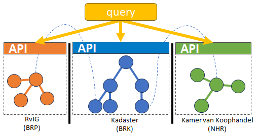
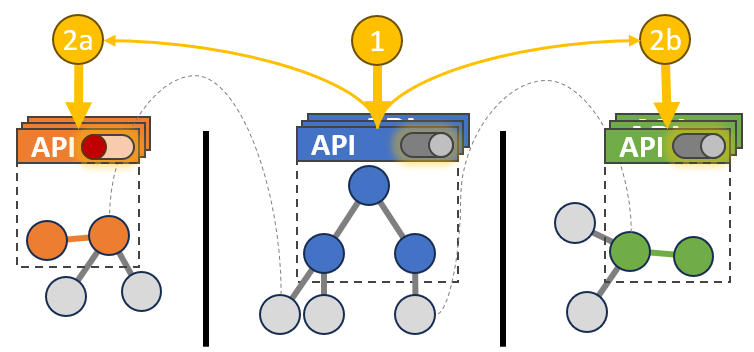
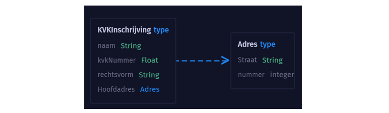
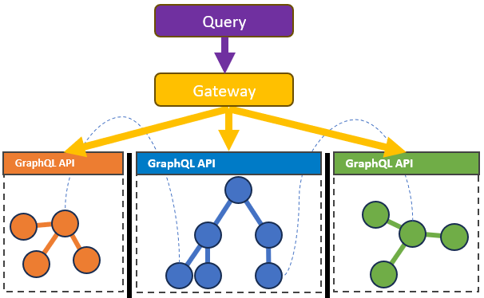
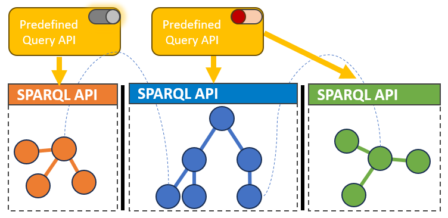
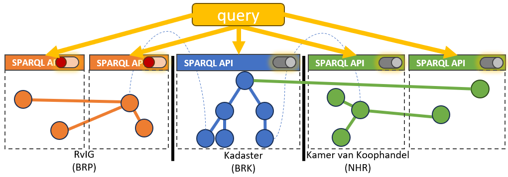

Gegeven de behoefte aan [autorisatie](./autorisatie.md) in een [federatieve bevraging](../index.md) én de
requirements van [afschermingspatronen](./afschermingspatronen.md) zijn er verschillende
technologische oplossingsrichtingen te bedenken.

Verschillende technologische oplossingen bieden verschillende kansen en uitdagingen om de doelen van Lock-Unlock te behalen. De technologische oplossingen zijn eindeloos en toch beperkt in het kader van een federatief datastelsel en Linked Data. In ons desk research zijn we diverse standaarden, voorbeelden en implementaties tegengekomen (zie vorige secties).

In het hoofdstuk [federatieve bevraging](../index.md) wordt al het onderscheid en verschillen beschreven
tussen de verschillende soorten [REST vs GraphQL vs SPARQL](../federatieve-bevraging/apis.md). Tbv afscherming en autorisatie bestaan er voor [REST API's](#rest-api) en [GraphQL API's](#graphql-api) al gestandaardiseerde uitwerkingen. Rondom Linked Data zijn er wel ideeën en concepten maar bestaat [autorisatie als Linked
Data](#autorisatie-als-linked-data) nog niet echt. Deze kunnen we grofweg verdelen en bundelen in de volgende selectie van technologische oplossing(srichtingen):

## Query Auditing

Gegeven de wens om vrije bevraging (query) tot onze beschikking te houden én te voldoen aan de wens
tot [auditing](./autorisatie.md#auditing), is het noodzakelijk om vast te leggen welke queries er
worden gesteld. Dit is vooral van belang in geval van Linked Data en minder in geval van [REST
API's](#rest-api) en [GraphQL API's](#graphql-api), aangezien deze minder mogelijkheden bieden voor
alle [afschermingspatronen](./afschermingspatronen.md).

Deze technologische oplossing is geen oplossing voor autorisatie. Bij alleen query auditing kan de gebruiker namelijk alle data bevragen en worden slechts de queries met bijbehorende context (denk bijv. aan de gebruiker en meegegeven referentie naar doelbinding) opgeslagen. Vervolgens kan er achteraf handmatig of wellicht automatisch bepaald worden of er onrechtmatige vragen/queries zijn gesteld en of dat er onterecht toegang is verkregen tot gesloten gegevens. 

Deze technologische oplossing wordt verder verkend in track 2 van het Lock-Unlock project. Hierbij willen we onder andere kijken naar de [GEMMA verwerkingenlogging](bestaande-implementaties.md#gemma-verwerkingenlogging).

|  |
| :--: |
| Query Auditing | 

**Kansen voor Lock-Unlock**

- Om te kunnen verantwoorden dat (met name persoons)gegevens op een juiste manier verwerkt worden,
  is het nodig om de verwerking te bewaren. Dat gebeurt door de queries te loggen.
- Het loggen van queries en context biedt altijd de mogelijkheid om later onregelmatigheden op te
  sporen.

**Uitdagingen voor Lock-Unlock**

- Query Auditing is geen oplossing voor autorisatiecontroles.
- Uitdagingen rondom het kunnen toepassen van de GEMMA verwerkingenlogging gaan we in track 2
  beproeven.
    - De standaard wordt doorontwikkeld wat onzekerheid geeft rondom de stabiliteit van de
      standaard.
    - Query logging is niet gestandaardiseerd en mogelijkheden in producten zijn nog onduidelijk.

## Autorisatie in REST API

Bij een REST API wordt data in JSON formaat (JavaScript Object Notation) geretourneerd over HTTP.
Dit laatste onderdeel, namelijk HTTP, geeft direct de mogelijkheden van deze oplossingsrichting.
Alles wat met HTTP kan, kan met REST API’s. Dit is gestandaardiseerd en is op dit moment breed
beschikbaar in vele platformen op een uniforme wijze. De standaard die hier voornamelijk een rol
speelt, is <a href="https://oauth.net/2/" target="_blank">OAuth2</a>. Hierin is het mogelijk om met
username/password, een token als een ‘API Key’ of een certificaat authenticatie te doen en rollen
mee te geven om autorisatie af te dwingen.

REST API’s zijn voor specifieke ontsluiting van data. Een soort **ON/OFF** beslissing. Een REST API
kan een gehele dataset betreffen. Of juist een subset, waarbij een verticale subset gemakkelijker is
dan een horizontale subset. Een REST API is altijd specifiek en daarom wordt voor elke toepassing of
ontsluiting een nieuwe API ontwikkeld. Een samengestelde dataset of meerdere datasets betekent een
nieuwe API. Als een andere subset dan in de beschikbare API’s gewenst is, betekent dat de
ontwikkeling van een nieuwe API.

|  |
| :--: |
| Authorisation REST API |

**Kansen voor Lock-Unlock**
Veel data is al dmv een API beschikbaar, waarbij dit al vaak REST API’s betreft. Soms nog voorlopers als SOAP. De techniek is gestandaardiseerd met HTTP (oa OAuth2) en in vele technologie stacks beschikbaar.

**Uitdagingen voor Lock-Unlock**
Afscherming van data is op het niveau van de REST API. Autorisaties geven toegang of niet. Het is aan of uit, ja of nee. Er zijn geen gradaties van autorisaties mogelijk. Er zijn geen mogelijkheden om andere datasets of subsets op te vragen dan dat er in de API’s (collectie) wordt aangeboden. Er is orkestratie noodzakelijk om meerdere datasets over meerdere API’s te bevragen. Navigeren en vrij bevragen is niet mogelijk.

| Requirement        | Support                            |
| ------------------ | ---------------------------------- |
| Horizontale subset |  |
| Verticale subset   | ✅                                  |
| Richting beperken  | ✅                                  |
| Vrije query        | ❌ |

## Autorisatie in GraphQL API

GraphQL is gebaseerd op een voor-gedefinieerd schema (zie voorbeeld). Dit schema is een object georiënteerde benadering waarin objecten en de relaties beschreven zijn. Welke objecten beschikbaar zijn, welke relaties en in welke richting die relaties mogelijk zijn, staat gedefinieerd in het schema. Dit geeft mogelijkheden voor het afschermen van data. Er kunnen filters toegepast worden, zowel als gebruiker en in de API. Bijvoorbeeld: _geef alle KVKInschrijvingen met rechtsvorm "BV"_. Of in het voorbeeld hiernaast: _vanuit KVKInschrijving kan wel het adres opgevraagd worden maar niet andersom_.

Met een GraphQL Gateway is het mogelijk om meerdere samenhangende datasets tegelijkertijd te bevragen. De Gateway distribueert de query en stelt de resultaten samen tot een samenhangend geheel (schema stitching).

Er zijn verschillende manieren om de objecten in het schema te beveiligen. Net zoals met REST API’s kan wel of geen toegang verleent worden tot de hele API. Met GraphQL is het ook mogelijk om in het schema te configureren welke rollen toegang krijgen tot objecten of attributen daarvan. Waar in REST API’s meerdere API’s beschikbaar gemaakt zouden worden, kan dat met GraphQL in één GraphQL API/Gateway, uiteraard beperkt tot het betreffende schema.

**Kansen voor Lock-Unlock**
Verfijnde autorisatie op schema niveau mogelijk. Binnen het schema zijn (vrije) queries mogelijk. Gateways ondersteunen federatieve queries.

**Uitdagingen voor Lock-Unlock**
GraphQL kan aangeboden worden op basis van een Linked Data architectuur, maar volgt niet volledig de Linked Data principes.

| Requirement        | Support                            |
| ------------------ | ---------------------------------- |
| Horizontale subset |  |
| Verticale subset   | ✅                                  |
| Richting beperken  | ✅                                  |
| Vrije query        |  |

## Linked Data - Predefined Queries

Het is mogelijk om in een SPARQL endpoint vooraf queries te definiëren. Hoewel de basis vrije
bevraging is, worden alleen van tevoren gecontroleerde queries toegestaan. De vooraf gedefinieerde
queries kunnen natuurlijk variëren per rol en wellicht kunnen die achter een gewone REST API
geïmplementeerd worden. De uitwerking hiervan is dat er wél Linked Data technieken gebruikt worden,
maar dat de oplossing dichter bij het REST API’s scenario komt mbt gesloten data. Voor open data is
een open (dus apart) SPARQL endpoint beschikbaar.

**Kansen voor Lock-Unlock**

Deze oplossing maakt het mogelijk om Linked Data technieken te gebruiken en data af te schermen. De
Predefined Queries zijn een eenvoudige manier om afscherming mogelijk te maken á la REST API’s.

**Uitdagingen voor Lock-Unlock**

Er is geen standaard voor het vastleggen Predefined Queries. Dit is daarom afhankelijk van de technische oplossing of dit beschikbaar is of niet. Deze oplossing levert nauwelijks meer dan de mogelijkheden bij REST API’s. Het is namelijk voor de gebruiker niet meer mogelijk om zelf queries op te stellen en te navigeren door de knowledge graph voor gesloten data.

| Requirement        | Support                            |
| ------------------ | ---------------------------------- |
| Horizontale subset |  |
| Verticale subset   | ✅                                  |
| Richting beperken  | ✅                                  |
| Vrije query        | ❌                                  |

## Linked Data - Predefined Subgraphs

Zoals er met REST API’s meerdere API’s beschikbaar worden gesteld voor de verschillende doelgroepen
en autorisaties, is het in Linked Data mogelijk om meerdere sub-graphs te definiëren / publiceren.
Dit geeft vergelijkbare mogelijkheden wat betreft afscherming en toegang en biedt in tegenstelling
tot Predefined Queries wél de mogelijkheid tot vrij query’n.

**Kansen voor Lock-Unlock**

Door het werken met Predefined Sub-Graphs is het mogelijk om toegang op subset niveau te regelen,
zowel horizontaal (gebruiker X mag alleen bij die specifieke instanties) als verticaal (gebruiker Y
mag wel de koopsom zien maar niet de eigenaar). Op die sub-graphs kan de gebruiker vervolgens vrij
query’n en ook federatieve queries doen.

**Uitdagingen voor Lock-Unlock**

Aangezien bij deze oplossing niet naar de querykant zelf wordt gekeken, is het slechts beperkt
mogelijk om de richting van de vraag te beperken. Daarnaast zijn de mogelijkheden beperkt tot de
beschikbare Predefined Sub-Graphs. Dat betekent voorbereiding en beperking in afscherming. De
sub-graphs zijn afgeleiden van de originele totale dataset / graph. Het mechanisme voor het
beschikbaar maken van de sub-graphs bepaalt actualiteit, beschikbaarheid, etc.

| Requirement        | Support                            |
| ------------------ | ---------------------------------- |
| Horizontale subset | ✅                                  |
| Verticale subset   | ✅                                  |
| Richting beperken  |  |
| Vrije query        |  |

## Autorisatie als Linked Data

De autorisatie als Linked Data is een geheel andere benadering dan voorgaande technologische
oplossingsmogelijkheden. Het houdt in dat de autorisatie zelf als Linked Data wordt uitgedrukt.
Daarvoor zijn twee onderdelen nodig:

1. De autorisatie ontologie is een "woordenboek" welke de autorisatie terminologie bevat. Denk aan
   Gebruiker, Rol, Toegestaan, Autorisatie hiërarchie, etc. Zo’n vocabulaire zou gestandaardiseerd
   moeten zijn. Deze bestaat op dit moment nog niet, maar sluit goed aan bij de wereld van Linked
   Data.
1. De autorisatie configuratie bevat de specifieke autorisatieregels voor een resource. In deze
   configuratie wordt autorisatie metadata toegevoegd (verrijkt) aan bestaande ontologie van de
   resource. Bijvoorbeeld Binnen de BRK is het anonieme Gebruikers niet toegestaan het
   LaatsteKoopsom Predicate op te vragen.

Deze twee delen samen vormen een autorisatiebeleid dat door machines te interpreteren en gebruiken
is. Door dit autorisatiebeleid uit te drukken in Linked Data kunnen dezelfde technieken gebruikt
worden als voor het bevragen van de Linked Data zelf.

**Kansen voor Lock-Unlock**

- Autorisaties kunnen gerelateerd worden aan de reden van toegang (of niet) naar data. Dit is in
  bestaande technologische oplossing niet of nauwelijks mogelijk. Hier liggen enorme kansen voor
  vooraf en achteraf controle en uitleg.
- Autorisatie wordt in dezelfde “technische taal" uitgedrukt als de data.
- Uitgebreide evaluatie van vrije queries, data partionering, etc, etc wordt hierdoor mogelijk.
- Door de standaardisatie is meervoudig gebruik in meerdere implementaties en oplossingen mogelijk
  van autorisatiebeleid.

**Uitdagingen voor Lock-Unlock**

- Er bestaat nog geen gestandaardiseerde ontologie voor autorisatie. Hiervoor zullen wij zelf de
  eerste aanzet moeten doen (er zijn wel enkele papers beschikbaar met suggesties en voorbereidend
  werk).
- Er zijn (dus) ook nog geen standaard implementaties voor deze oplossingsrichting.