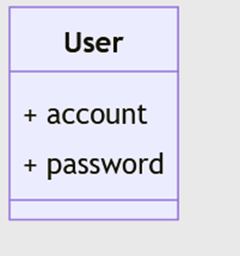

# Autorisatie Ontologieën

Binnen het Autorisatie als Linked Data concept speelt de Autorisatie Ontologie een belangrijke rol. Deze ontologie wordt op deze pagina verder toegelicht maar eerst wordt ingegaan op de ondersteunende ontologieën.

## Ondersteunende Ontologieën

### Authenticatie ontologie

Hoewel we authenticatie als out-of-scope hebben gesteld in dit project hebben we natuurlijk behoefte om gebruikers vast te leggen die vervolgens gekoppeld kunnen worden aan autorisatie regels. Hiervoor is een overversimpelde authenticatie ontologie gemaakt met een klasse "User". 

|  |
| :--: |
| User klas in authenticatie ontologie |

Een standaard gebruiker is alvast aanwezig in deze autorisatie ontologie en dat is de gebruiker "anonymous" oftewel een gebruiker die niet ingelogd is. Om gebruikers te definieren kan er een nieuwe dataset gemaakt worden op basis van de authenticatie ontologie en daarmee kunnen nieuwe gebruikers ("User") aangemaakt worden.

Een online versie van deze ontologie is te vinden via deze [link](https://data.labs.kadaster.nl/lock-unlock/authentication-ontology/schema).

De autorisatie ontologie maakt gebruik van de authenticatie ontologie. Dit kan door middel van een owl:import statement te maken waarbij de authenticatie ontologie geimporteerd wordt.  

### Logging Ontologie

Een simpele logging ontologie is opgezet voor het loggen van SPARQL queries inclusief datumstempels en natuurlijk een koppeling naar de gebruiker. Zie hieronder voor een weergave van de ontologie. Gebeurtenissen zoals binnenkomende Sparql queries worden vastgelegd met tijdstempels en inclusief referentie naar de persoon.  

|  |
| :--: |
| Logging ontologie |

Dit heeft als doel om aan te kunnen tonen dat we queries en de afhandeling ervan goed kunnen loggen om evt in een later stadium audits te kunnen ondersteunen. Implicaties van deze logging (denk aan AVG bijvoorbeeld) is buiten scope van dit project. 

## Autorisatie Ontologie

### Overzicht
De autorisatie ontologie importeert de authenticatie ontologie datasets zodat gebruikers(users) aanwezig zijn als read-only data. Vervolgens kunnen deze gebruikers gerelateerd worden aan verschillende regels die elk specifieke informatie nodig hebben. Hieronder een overzicht van de Autorisatie ontologie. 

|  |
| :--: |
| Overzicht autorisatie ontologie |

Deze ontologie is ook beschikbaar via deze [link](https://data.labs.kadaster.nl/lock-unlock/authorisation-ontology/schema).

### Gebruikers en Autorisatie Regels
Een gebruiker kan verbonden zijn met meerdere rollen. Rollen kunnen verbonden zijn met meerdere security groeps. Elke security groep kan meerdere (autorisatie) regels bevatten. 

|  |
| :--: |
| Gebruikers en autorisatie regels |

Op deze manier kunnen individuele gebruikers gekoppeld worden aan Rollen die via de tussenstappen uiteindelijk gekoppeld zijn aan verschillende autorisatie regels. De aanwezigheid van security groeps zorgt ervoor dat bijelkaarhorende regels gegroepeerd worden opdat deze set makkelijk te herbruiken zijn voor andere rollen. 

### Regeltypes
Er zijn meerdere regeltypes die elk of een andere functionaliteit bieden om autorisatie te modelleren. Hieronder een diagram van verschillende regeltypes. 

|  |
| :--: |
| Regeltypes |

Zo is er een regel (InAccessableService) die zogenaamde 'service' gebruik binnen SPARQL aan banden kan leggen. Andere voorbeelden van regeltypes zijn bijvoorbeeld de regeltype die toegang tot graphs kan reguleren, regelype voor het filteren op predicaten (in bepaalde graphs) en de horizontale subset regeltype. Enkele van deze regeltypes zijn geïmplementeerd zoals regels voor graaf-gebaseerde autorisatie, predicaat-gebaseerde autorisatie en horizontale subsets. Het betreft hier wel een Proof-of-Concept implementatie. Directionele regels zijn buiten beschouwing gelaten. Het lijkt heel goed mogelijk om nieuwe regeltypes toe te voegen die bijvoorbeeld andere informatie behoeven. 

### Graaf-gebaseerde Autorisatie Regels
Met de "AccessibleDataset" rege kun je gebruikers toegang geven tot "Datasets". Een Dataset bestaat uit 0 of meer graven (graphs). Oftewel hiermee kun je instellen welke gebruiker toegang heeft tot welke graven in de triplestore. 

|  |
| :--: |
| Graaf-gebaseerde autorisatieregels |

Via SecurityGroeps kunnen 'instanties' (of eigenlijk individuals in Linked Data) van deze regel ('AccessibleDataset') gekoppeld worden aan Rollen en Gebruikers. Door de relatie naar een 'Dataset' is bekend welke dataset deze gebruiker toegang heeft. "Graven" in de triplestore zijn verbonden met "Datasets" waardoor een implementatie dus precies weet of een gebruiker toegang heeft tot een graaf of niet.

### Predicate-gebaseerde Autorisatie Regels
Met de predicate regel is het mogelijk om een predicaat (een soort kenmerk) af te schermen. Een goed voorbeeld is "koopsom" in dit project maar ook eigenaar of Naam, Adres, Woonplaats gegevens. Je kunt met deze regel de dataset in tact laten maar ervoor zorgen dat gegevens van bepaalde predicaten afgeschermd worden. Hieronder is de regeltype afgebeeld.

|  |
| :--: |
| Predicate-gebaseerde autorisatie regels |

De regel heeft een link naar een 'Dataset' waarin de regel actief is en een link naar een 'Parameter' met een attribuut 'uri' waarin het predicaat genoemd staat. Dit kan dan een link zijn naar een predicaat in schema van een dataset. Bijvoorbeeld een link naar het kenmerk "koopsom" in een BRK dataset.

### Horizontale Subset Regels
Met horizontale regels kunnen we niet op schema nivo maar op dataset nivo zaken afschermen. Denk hierbij bijvoorbeeld aan volledige toegang tot alle data elementen maar alleen voor een registratieve ruimte, bijvoorbeeld een gemeente. Een ander voorbeeld is toegang tot alle pand informatie van 'eigen' panden. Hieronder is het model voor regels mbt horizontale subsets

|  |
| :--: |
| Horizontale subset regels |

Het model laat zien dat er een predicaat nodig is dat gevuld is met een waarde. Deze restrictie moet altijd waar zijn indien de resource van een gespecificeerde klasse is. Hiermee kunnen horizontale subsets gedefinieerd worden.

