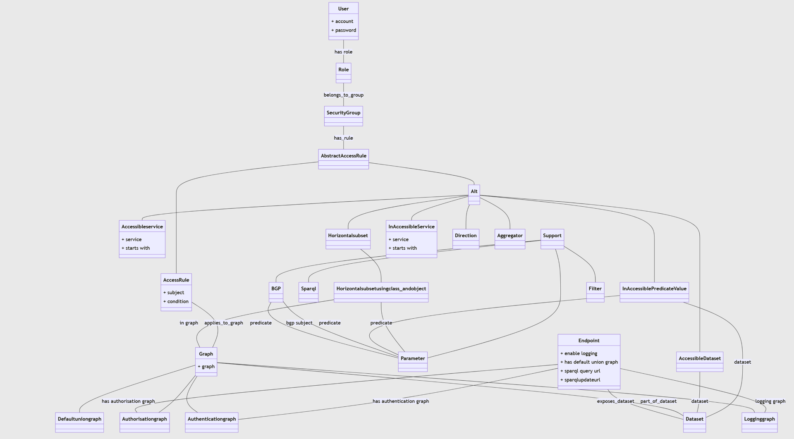

# Autorisatie Ontologieen

## Ondersteunende ontologieen

### Autenticatie ontologie

Hoewel we authenticatie als out-of-scope hebben gesteld in dit project hebben we natuurlijk behoefte om gebruikers vast te leggen die vervolgens gekoppeld kunnen worden aan autorisatie regels. Een standaard gebruiker is alvast aanwezig in deze autorisatie ontologie en dat is de gebruiker "anonymous" oftewel een gebruiker die niet ingelogd is. Om gebruikers te definieren kan er een nieuwe dataset gemaakt worden op basis van de authenticitie ontologie en daarmee kunnen nieuwe "Users" aangemaakt worden.
De autorisatie ontologie maakt gebruik van de authenticatie ontologie. Dit kan door middel van een owl:import statement te maken waarbij de authenticatie ontologie geimporteerd wordt.  

### Logging ontologie
Een hele simpele logging ontologie is opgezet voor het loggen van Sparql queries inclusief datum stempels en natuurlijk een koppeling naar de gebruiker. Dit had als doel om te demonstreren dat we queries en de afhandeling ervan goed kunnen loggen. Verdere implicaties van deze logging is buiten scope van dit project.

## Autorisatie ontologie
### Overzicht
De autorisatie ontologie importeert de authenticatie ontologie datasets zodat gebruikers(users) aanwezig zijn als readonly data. Vervolgens kunnen deze gebruikers gerelateerd worden aan Rollen die gekoppeld zijn aan SecurityGroup. Een gebruiker kan verbonden zijn met meerdere rollen. Rollen kunnen verbonden zijn met meerdere security groeps. Elke security groep kan meerdere (autorisatie) rules bevatten. 

### Users and Rules

### Rule types

### graph rules

### predicate rules

### horizontal subset rules

