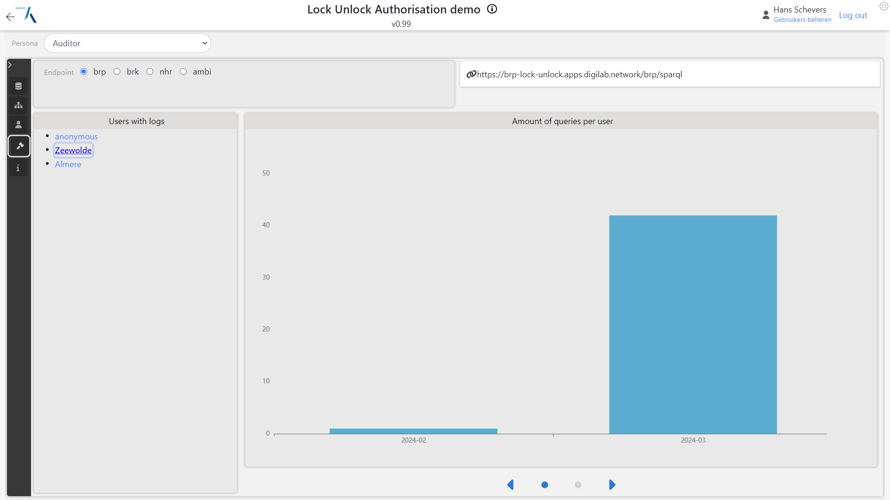

Voor elk register is een beschermd SPARQL endpoint opgezet dat op een aparte server werkt. Om de
federatieve samenwerking van de datasets goed demonstrabel te maken is er zelfs gekozen om
infrastructuur van Kadaster en van het DigiLab te gebruiken om echt een heterogene, gedistribureerde
infrastructuur te hebben als basis voor de demo's. Zie ook
[testopstelling](../../federatieve-bevraging/testopstelling.md).

|  .  |
| :--------------------------------: |
| Netwerk van beveiligd triplestores |

Elke triplestore is voorzien van eigen data en een afschermings kennisgraaf bestaande uit de
autorisatie ontologie aangevuld met een specifieke configuratie.

Daarmee zijn de volgende SPARQL endpoints aanwezig:

- BRK -> <a href="https://brk.dst.test.cloud.kadaster.nl/"
  target="_blank">https://brk.dst.test.cloud.kadaster.nl/</a>
- ANBI -> <a href="https://anbi-lock-unlock.apps.digilab.network/"
  target="_blank">https://anbi-lock-unlock.apps.digilab.network/</a>
- BRP -> <a href="https://brp-lock-unlock.apps.digilab.network/"
  target="_blank">https://brp-lock-unlock.apps.digilab.network/</a>
- NHR -> <a href="https://nhr-lock-unlock.apps.digilab.network/"
  target="_blank">https://nhr-lock-unlock.apps.digilab.network/</a>

De demonstrator staat live en is te vinden via: <a
href="https://labs.kadaster.nl/demonstrators/unlocked/demonstrator" target="_blank">labs.kadaster.nl
| Lock-Unlock
Demonstrator</a>

## Triplestore per register

In deze omgevingen is het mogelijk om SPARQL queries te schrijven en uit te voeren op de
triplestore. Zonder 'login' worden deze queries herschreven en is daarmee afgeschermde data niet
toegankelijk. Query resultaten kunnen daardoor leeg zijn. Door de URL parameter `Persona` kan er
makkelijk geswitcht worden tussen persona's met verschillende rechten. Hiermee wordt het
demonstreren en onderzoeken van de werking van het geheel vereenvoudigt. Het moge natuurlijk
duidelijk zijn dat een echt (centraal) authenticatie systeem nodig is om dit goed af te handelen.

Per triplestore kan er nu makkelijk van persona gewisseld worden en kan er per triplestore en per
persona SPARQL queries geschreven worden die op basis van de autorisatie kennisgraaf al dan niet
antwoorden geeft. Zo is bijv BRP data niet beschikbaar voor anonieme gebruikers. Gebruik je persona
"System" dan heb je volledig toegang en kan alle data opgevraagd worden. (NB Het betreft hier
fictieve data.)

. 

## Federatief bevragen met autorisatie

De persona's zijn aanwezig in alle triplestores. Daarmee kan een federatieve query geschreven worden
die op basis van één persona resultaten teruggeeft op basis van de resultaten die elke triplestore
voor deze persona beschikbaar stelt. Hiervoor kan gebruik gemaakt worden van het `service` keyword
binnen SPARQL die op die manier een ander SPARQL endpoint aanspreekt. Hieronder is screenshot te
zien van een SPARQL query in de Kadaster BRK triplestore werkend op de Kadaster infrastructuur die
een vraag stelt aan de (fictieve) NHR dataset op de Digiab omgeving.

. 

## Demonstrator: applicaties bovenop SPARQL endpoints

Een user interface kan vervolgens gebruikmaken van deze infrastructuur met SPARQL endpoints.

Linksbovenin de demo omgeving kan er snel gewisseld worden van persona. In het eerste screenshot
zijn weinig resultaten te zien. Hier wordt op basis van de persona "Anonieme gebruiker" BRP gegevens
opgevraagd via een SPARQL query. De query vraagt een set van (random) personen op.  Dit levert geen
resultaten op en dat is volgens de autorisatie kennisgraaf correct.

. 

De persona "gemeente Almere" heeft wel toegang tot de BRP maar alleen voor personen die woonachtig
zijn in Almere. Dezelfde query die (random) personen opvraagt geeft nu wel resultaten en een geeft
random personen terug die woonachtig zijn in Almere.

. 

Deze persona kan ook perceel info opvragen zoals laatste koopsom en eigenaren van een perceel.
Hiervoor is toegang nodig tot de BRK maar ook de BRP en de NHR voor meer info over de eigenaren.
Deze info kan verder aangevuld worden met grafische perceel informatie die openbaar is.

. 

Bovenin het screenshot wordt via een SPARQL query percelen opgevraagd met koopsommen. De query
vraagt om alle percelen in het hele land en vraagt via de BRK triplestore de laatste koopsommen op.
Voor persona Almere worden alleen koopsommen van Almere gevonden aangezien deze persona daartoe
toegang heeft. Dit levert een percelen kaart op van Almere. 

Hieronder is een video gemaakt die bovenstaande zaken demonstreert.

<video controls>
  <source src="https://github.com/kadaster-labs/lock-unlock-docs/raw/main/docs/autorisatie-als-linkeddata/video/demo.mp4" type="video/mp4">
Your browser does not support the video tag.
</video>

## Logging

Aan deze demonstrator is ook logging toegevoegd. Elke query die binnenkomt wordt opgeslagen. Hierbij
wordt de persona ook gelogd waardoor je percies weet wanneer welke persona welke query heeft
verstuurd. Zo je bijvoorbeeld makkelijk zien wie wanneer queries heeft afgevuurd op de triplestors.
Hieronder een screenshot met het aantal queries per maand per persona. Ook de individuele queries
zijn zichtbaar met daarbij een tijdstempel. 

. 

Naast de originele query wordt ook de herschreven query bewaard. Hieronder een screenshot van de log
informatie waarbij zowel de originele als de herschreven query op te vragen is. In het screenshot is
een deel van de originele en herschreven query te zien.

. 
