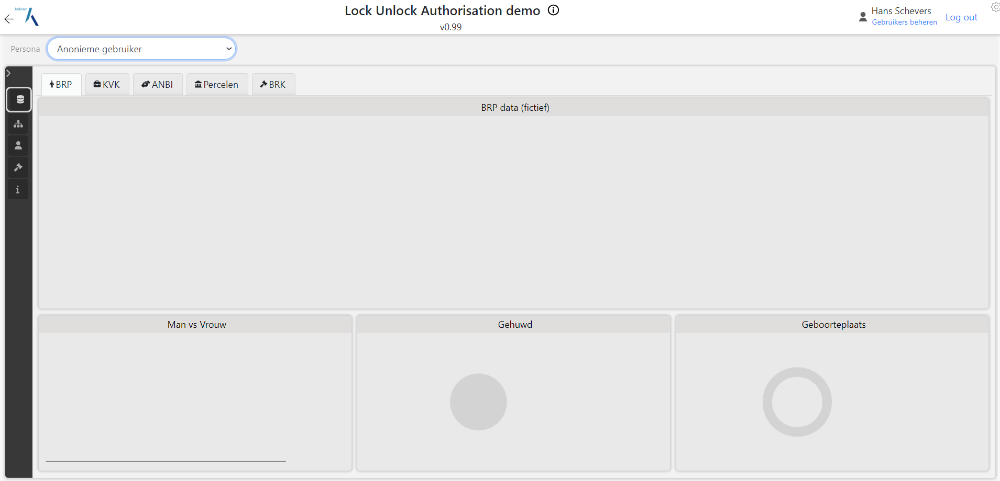
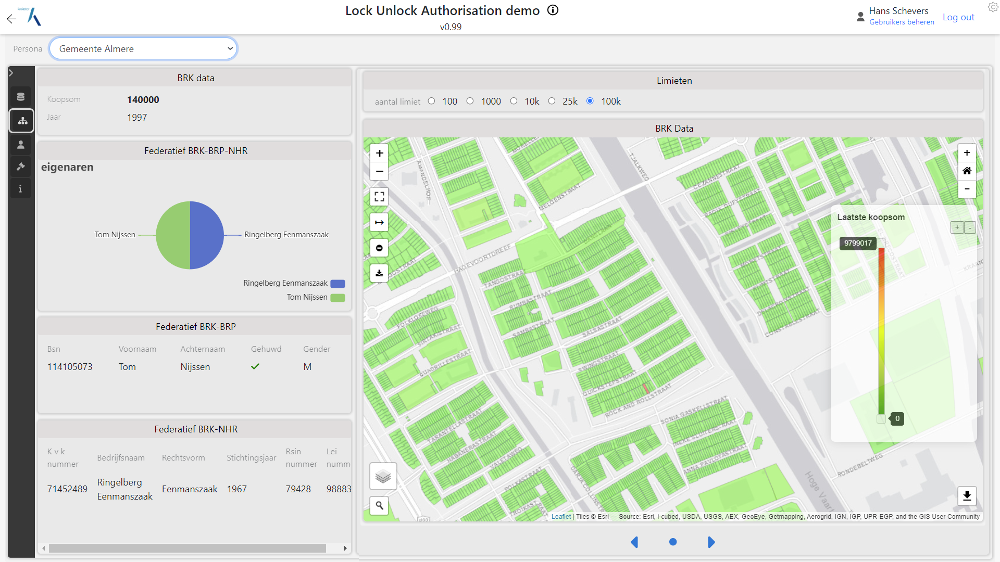
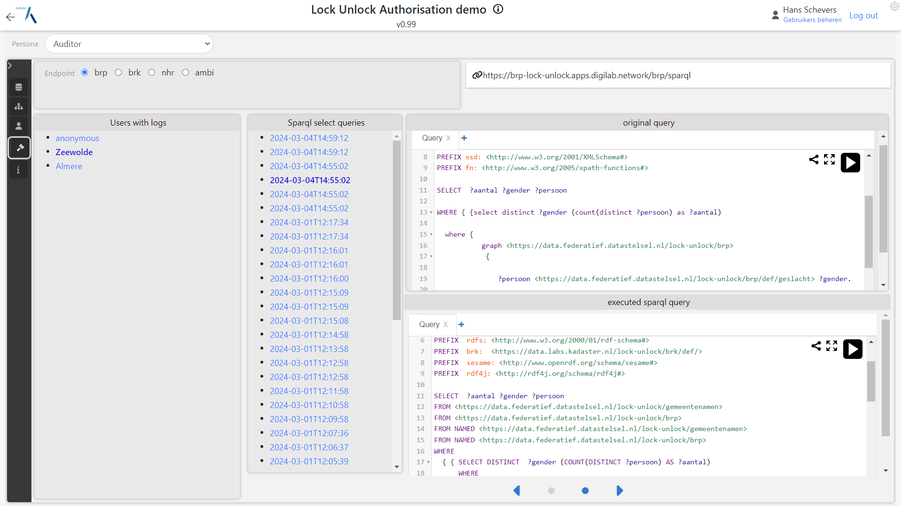

#Overzicht

Voor elk register is een beschermde sparql endpoint opgezet dat op een aparte server werkt. Om de
federatieve samenwerking van de datasets goed demonstrabel te maken is er zelfs gekozen om
infrastructuur van Kadaster en van het DIGI-Lab te gebruiken om echt een heterogene,
gedistribureerde infrastructuur te hebben als basis voor de demo's. . 

Elke triplestore is voorzien van eigen data en een afschermings kennisgraaf bestaande uit de
autorisatie ontologie aangevuld met een specifieke configuratie.

Daarmee zijn de volgende sparql endpoints aawenzig:

- BRP:
  [https://brp-lock-unlock.apps.digilab.network/](https://brp-lock-unlock.apps.digilab.network/)

- NHR:
  [https://nhr-lock-unlock.apps.digilab.network/](https://nhr-lock-unlock.apps.digilab.network/)

- ANBI:
  [https://anbi-lock-unlock.apps.digilab.network/](https://anbi-lock-unlock.apps.digilab.network/)

- BRK: [https://brk.dst.test.cloud.kadaster.nl/](https://brk.dst.test.cloud.kadaster.nl/)

# Triplestore per register

In deze omgevingen is het mogelijk om sparql queries te schrijven en te executeren op de
triplestore. Wel worden deze queries herschreven en is afgeschermde data niet toegankelijk. Query
resultaten kunnen daardoor leeg zijn.  Door de URL parameter "Persona" kan er makkelijk veranderd
worden van Persona's met verschillende rechten. Hiermee wordt het demonstreren en onderzoeken van de
werking van het geheel vergemakkelijkt. Het moge natuurlijk duidelijk zijn dat een echt (centraal)
authenticatie systeem nodig is om dit goed af te handelen.

Per triplestore kan er nu makkelijk van persona gewisseld worden en kan per triplestore en per
persana sparql queries geschreven worden die op basis van de autorisatie kennisgraaf al dan niet
antwoorden geeft. Zo is bijv BPR data niet beschikbaar voor anonieme gebruikers. Gebruik je persona
"System" dan heb je volledig toegang en kan alle data opgevraagd worden. Het betreft hier fictieve
data.

. 

# Federatief bevragen met autorisatie

De persona's zijn aanwezig in alle triplestores. Daarmee kan een federatieve query geschreven worden
die op basis van 1 persona resultaten teruggeeft op basis van de resultaten die elke triplestore
voor deze persona beschikbaar stelt. Hiervoor kan gebruik gemaakt worden van het Service keyword
binnen sparql die een ander sparql endpoint aanspreekt. Hieronder is screenshot te zien van een
sparql query in de kadaster BRK triplestore werkend op de kadaster infrastructuur die een vraag
stelt aan de (Fictieve) NHR dataset op de DIGI-Lab omgeving.

. 

# Demonstrator:  applicaties bovenop sparql endpoints
Nu dat de infrastructuur staat kan er een user-interface gebruik maken van de sparql endpoints.
Links bovenin de demo omgeving kan er snel gewisseld worden van persona. In het eerste screenshot
zijn weinig resultaten te zien. Hier wordt op basis van de persona "anonymous" BRP gegevens
opgevraagd via een sparql query. De query vraagt een set van (random) personen op.  Dit levert geen
resultaten op en dat is volgens de autorisatie kennisgraaf correct.

. 

De persona "Almere" heeft wel toegang tot de BRP maar alleen voor personen die woonachtig zijn in
Almere. Dezelfde query die (random) personen opvraagt geeft nu wel resultaten en een geeft random
personen terug die woonachtig zijn in Almere.

. 

De Almere persona kan ook perceel info opvragen zoals laatste koopsom en eigenaren van een perceel.
Hiervoor is toegang nodig tot de BRK maar ook de BRP en de NHR voor meer info over de eigenaren.
Deze info kan verder aangevuld worden met grafische perceel informatie dat openbaar is.

. 

Boven in het screenshot wordt via een sparql query percelen gevraagd met koopsommen. De query vraagt
om alle percelen in het hele land en vraagt via de BRK triplestore de laatste koopsommen op. Voor
persona Almere worden alleen koopsommen van Almere gevonden aangezien deze persona daartoe toegang
heeft. Dit levert een percelen kaart op van Almere. 

# Logging
Elke triplestore logt elke query die binnenkomt. Hierbij wordt de persona ook gelogd waardoor je
percies weet wanneer welke persona welke query heeft verstuurd. Naast de originele query wordt ook
de herschreven query bewaard. Hieronder een screenshot van de log informatie.  

. 

De demonstrator staat live en is te vinden via: [Lock-Unlock
Demonstrator](https://labs.kadaster.nl/demonstrators/unlocked/demonstrator)
