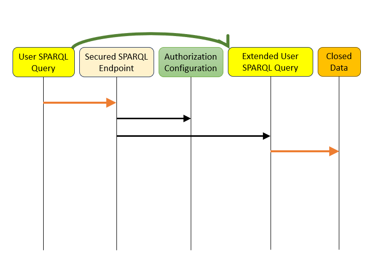

De SPARQL rewrite methode analyseert inkomende SPARQL queries en herschrijft deze alvorens ze door
te sturen naar de triplestore. De gebruiker communiceert dus met een soort SPARQL endpoint proxy die de query
herschrijft en doorstuurt naar de triplestore om vervolgens de resultaten weer terug te geven aan de
gebruiker.

 

Conceptueel wordt de query geanalyseerd en worden restricties toegevoegd aan de originele query: 

- Indien de gebruiker geen toegang heeft tot specifieke graphs in de triplestore dan worden queries
  gecontroleerd of ze geen ontoegankelijke graphs bevragen.
- Wanneer de query expliciet graphs gebruikt om data op te vragen worden deze gecontroleerd of de
  gebruiker daar toegang toe heeft.
- Bevat de query geen expliciete grahs dan worden deze toegevoegd aan de query opdat alleen
  informatie van graphs bevraagd worden waartoe de gebruiker toegang heeft.
- Horizontale subsets worden geïmplementeerd door resources te voorzien van extra filters die
  koppelingen buiten de horizontale subset eruit filteren.
- Andere rewrites betreffen het analyseren van onwenselijk predicate (property) gebruik:
    - Indien expliciete predicaten gebruikt worden waartoe de gebruiker geen rechten heeft dan
      worden deze predicaten vervangen door onbestaande predicaten zodat de query uitgevoerd kan
      worden maar geen ontoegankelijke data terug kan geven. 
    - Indien de predicaten niet expliciet aanwezig zijn in de query worden er filters toegevoegd die
      controleren of er geen afgeschermde predicaten gebruikt worden. 
