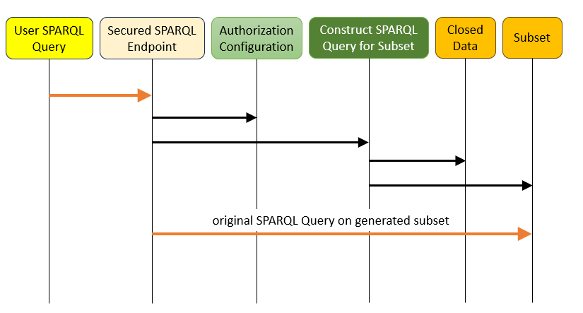

De subgraph methode werkt door een voorselectie te maken op basis van de regels die van toepassing
zijn voor de betreffende gebruiker. Daarna wordt de query uitgevoerd op deze voorselectie, waardoor
het onmogelijk wordt om ongeauthoriseerde gegevens op te vragen. Net als de rewrite methode kan dit
geïmplementeerd worden als een transparant proxy endpoint.

Conceptueel werkt de subgraph methode als volgt:

1. De gebruiker stuurt een query en zijn autorisatiegegevens in.
2. Het endpoint bepaalt welke autorisatieregels van toepassing zijn voor deze gebruiker.
3. Voor iedere regel wordt bepaald tot welke gegevens deze toegang verleent.
4. De toegankelijke gegevens van alle regels worden samengevoegd tot een subgraaf.
5. De ingestuurde query wordt uitgevoerd op deze subgraaf.
6. De resultaten van de query worden teruggestuurd naar de gebruiker.
