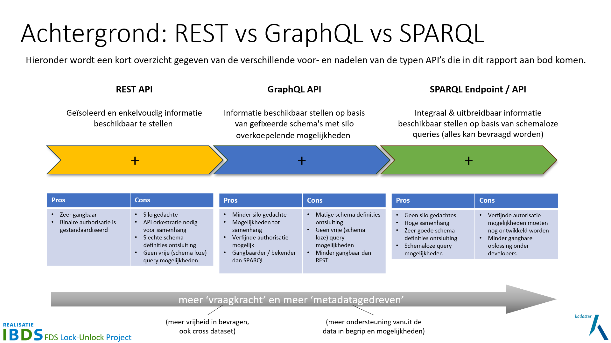

In de huidige stand van de techniek wordt met API meestal een **REST API** bedoeld, hoewel er vele
varianten van API's bestaan. Een REST API staat voor een API die gebruik maakt van internet
protocollen als TCP/IP en HTTP voor het bevragen. Er zijn echter ook andere API standaarden die
gebaseerd zijn op deze internet protocollen en in opkomst zijn, zoals **GraphQL** en **SPARQL**. Het
bestaan en de verschillen zijn relevant voor dit onderzoek. Hieronder worden deze verschillen
toegelicht.

- [REST](https://roy.gbiv.com/pubs/dissertation/rest_arch_style.htm) staat voor _Representational
  State Transfer_ waarmee geduid wordt op een _Resource_. Met een REST API kan een Resource bevraagd
  en (eventueel) ook gemuteerd worden en daarbij wordt (dus) gebruik gemaakt van de [HTTP
  methods](https://www.rfc-editor.org/rfc/rfc9110.html#name-method-definitions) als GET, PUT en
  POST. De data wordt in JSON formaat (JavaScript Object Notation) over HTTP uitgewisseld
  (transport) tussen een client en de server. REST API’s/RESTful-webservices zijn opgezet om
  geïsoleerd en enkelvoudige informatie beschikbaar te stellen. Elke API heeft één specifieke input
  en output. Relaties tussen objecten zijn in de (output) JSON als URL opgenomen welke direct
  gebruikt kan worden om dan een gerelateerd object op te vragen.
  
- [GraphQL](https://spec.graphql.org/) is een query taal (bevragingstaal) voor API's. Het is een
  nieuwe techniek welke sterk lijkt op een REST API wat betreft het resultaat, namelijk data in JSON
  formaat. Echter waar REST een reeks endpoints gebruikt per object, gebruikt GraphQL een enkel
  endpoint. Wat er opgevraagd kan worden en wat er geretourneerd wordt, is gepubliceerd in een
  GraphQL schema. Daarbij is het mogelijk om in het bevragen een selectie te maken van welke data je
  precies nodig hebt. Het is ook mogelijk om meerdere objecten te combineren, zolang dat volgens het
  schema beschikbaar is. Met een GraphQL gateway is het mogelijk om meerdere schema's en endpoints
  te bevragen, wat in de richting van een federatieve bevraging komt. GraphQL is daarmee flexibeler
  dan REST API’s en maakt het mogelijk om integraal informatie beschikbaar te stellen.
  
- [SPARQL](https://en.wikipedia.org/wiki/SPARQL), uitspraak 'sparkle', is een standaard query taal
  en protocol voor Linked (Open) Data op het web en voor RDF triple stores. SPARQL staat voor
  _'SPARQL Protocol and RDF Query Language'_ en biedt gebruikers de mogelijkheid om informatie op te
  vragen van databases of van elke resource die kan worden uitgedrukt in RDF (zie [Linked
  Data](./linkeddata.md)). Ook SPARQL is gebaseerd op HTTP net zoals REST en GraphQL en met deze
  zeer krachtige query taal is het inherent mogelijk om één of meerdere endpoints / API’s in
  samenhang te bevragen. SPARQL is volledig gebaseerd op Linked Data en de mogelijkheden daarvan.

Vergelijking: GraphQL is een mix tussen REST API’s en SPARQL. Het biedt vergelijkbare
functionaliteiten als REST API’s maar met meer mogelijkheden. Waar SPARQL volledig is gebaseerd op
[Linked Data](./linkeddata.md), voldoet GraphQL slechts ten dele aan (de) Linked Data (principes).
Bijvoorbeeld kunnen in een SPARQL endpoint / API meerdere schema’s gecombineerd worden, terwijl bij
GraphQL slecht één expliciet schema van toepassing is.

