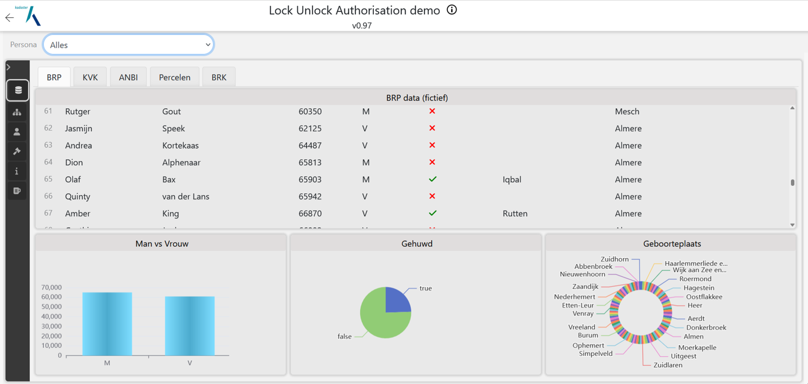
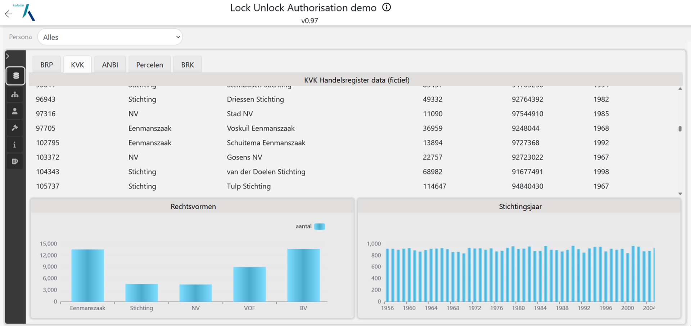
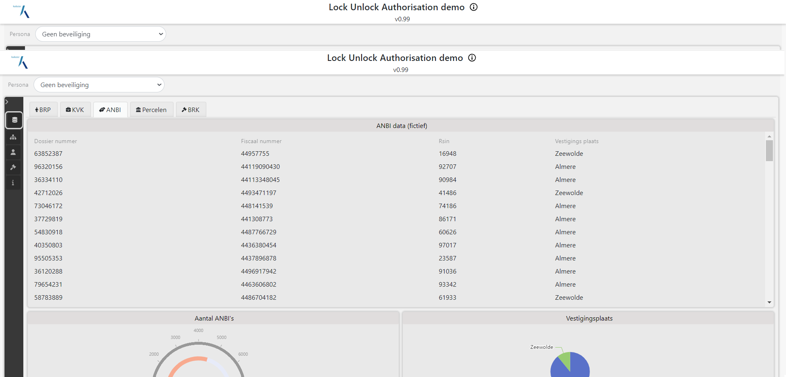
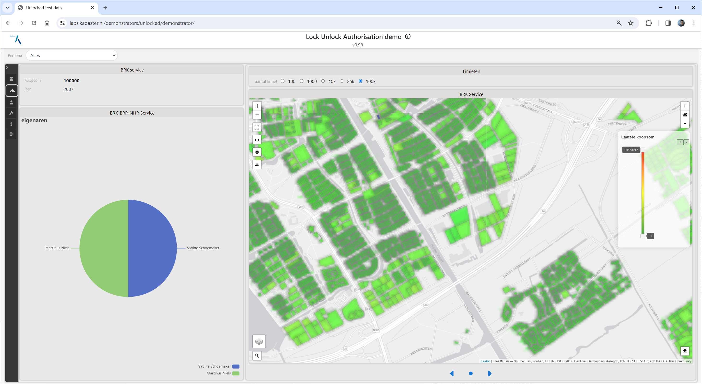

Genoeg beschreven over federatieve bevragingen. Nu willen we dat wel eens zien! Daarvoor maken we
gebruik van SPARQL (zie ook [API's](./apis.md) en [Linked Data](./linkeddata.md)). Deze query taal
kent het begrip `service` om aan te geven dat informatie van een ander endpoint opgehaald dient te
worden. Daarmee geeft de gebruiker het eerste endpoint, het endpoint dat direct bevraagd wordt, de
opdracht om andere endpoints te betrekken bij de uitvoering van de query. Uitgaande van de
[testopstelling#deployment](./testopstelling.md#deployment) ziet een federatieve bevraging er dan
schematisch als volgt uit:

Voordat we een voorbeeld zullen geven van een federatieve bevragingen duiken we eerst in de losse silo's. 

## BRP Silo

Fictieve data is gemaakt voor BRP gegevens. Meer dan 100.000 personen zijn aangemaakt met kenmerken
zoals naam, achternaam, geslacht & geboorteplaats. Hieronder is een dashboard te zien
waarin alle personen opgevraagd worden en waarbij ook een aantal doorsnedes worden getoond. Al deze vragen zijn gewone SPARQL
queries op het BRP SPARQL-endpoint.

## NHR Silo

Fictieve data is gemaakt voor NHR gegevens. Meer dan 25.000 inschrijvingen zijn gegenereerd met een KvK
nummer, rechtsvorm, naam, stichtingsjaar, etc. Hieronder is een dashboard te zien waarin alle
inschrijvingen in een tabel worden getoond en ook enkele grafieken met statistiche gegevens over deze
fictieve dataset.

## ANBI Silo

Fictieve data is gemaakt voor ANBI gegevens. Meer dan 4.000 stichtingen zijn aangemaakt met basale
informatie zoals een fiscaal nummer en een vestigingsplaats. Hieronder een screenshot met daarin een set van ANBI gegevens in tabelvorm en twee
grafieken.

## BRK Silo

De BRK data bestaat uit een open en een gesloten gedeelte. In het open gedeelte staat informatie over de percelen zoals de geometrie. Deze is voor deze demo aanwezig op de BRK silo. Tzt kan voor deze data ook het (echte) IMX-Geo sparql endpoint gebruikt worden. Voor dit project worden de percelen in Almere en Zeewolde gebruikt. Hieronder een screenshot
met daarin de percelen op de kaart. Deze informatie is afkomstig van IMX-Geo.

In het gesloten gedeelte van de BRK staat de fictieve eigendomsinformatie. Hierin staat wie de eigenaar/eigenaren is/zijn van een perceel. Voor de percelen van Zeewolde en Almere is hiervoor dan ook data gegenereerd. Dit resulteert in een dataset met meer dan 100k personen (prive en rechtspersonen). Ook staan hierin de koopsommen van de percelen. Hieronder een screenshot van de eigendom gegevens.

## Federatieve bevraging

Door deze silo's te combineren en integraal te bevragen kunnen er vragen beantwoord worden zoals: wat is de geboorteplaats van de eigenaar van perceel X of is het perceel in eigendom van een ANBI. Hieronder is een voorbeeld waarbij alle koopsommen zichtbaar zijn van percelen uit de BRK en waarbij eigendoms informatie aanwezig is van een geselecteerd perceel. 

 

In elke widget (tabel of grafiek) staat bij welke bronnen geraadpleegd zijn. Zo wordt er NHR informatie opgezocht in de NHR zoals stichtingsjaar en RSIN nummer voor NHR inschrijvingen die eigenaar zijn van het geselecteerde perceel. Ook de BRP wordt geraadpleegd om extra persoons informatie op te halen van een Perceels eigenaar. 

Deze demonstrator is [hier](https://labs.kadaster.nl/demonstrators/unlocked/demonstrator) te vinden. 

