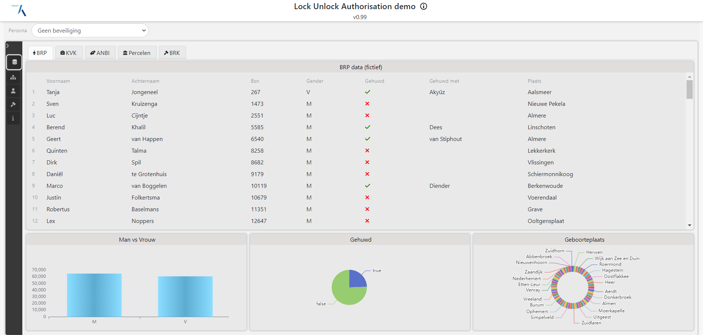
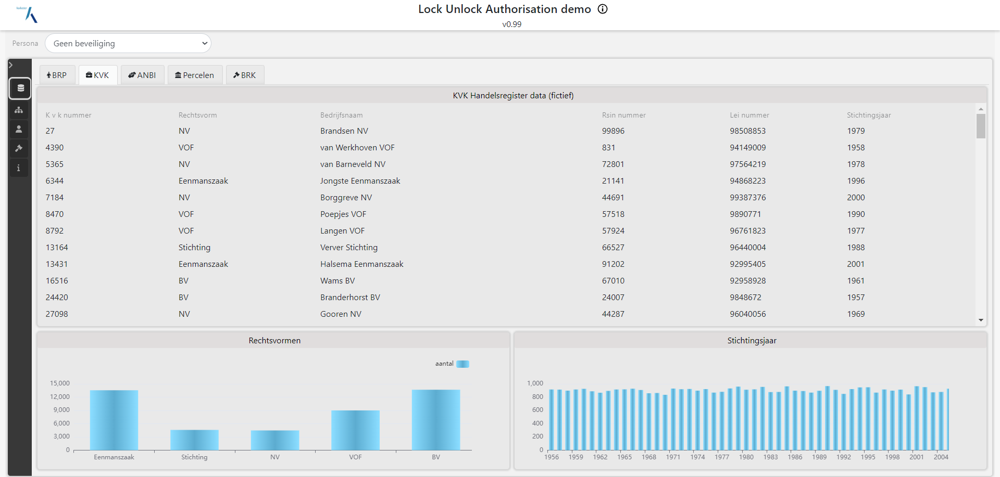

Genoeg beschreven over federatieve bevragingen. Nu willen we dat wel eens zien! Daarvoor maken we
gebruik van SPARQL (zie ook [API's](./apis.md) en [Linked Data](./linkeddata.md)). Deze query taal
kent het begrip `service` om aan te geven dat informatie van een ander endpoint opgehaald dient te
worden. Daarmee geeft de gebruiker het eerste endpoint, het endpoint dat direct bevraagd wordt, de
opdracht om andere endpoints te betrekken bij de uitvoering van de query. Uitgaande van de
[testopstelling#deployment](./testopstelling.md#deployment) ziet een federatieve bevraging er dan
schematisch als volgt uit:

## BRP Silo
Fictieve data is gemaakt voor BRP gegevens. Meer dan 100K Personen zijn aangemaakt met kenmerken zoals naam, achternaam, gender, geboorteplaats, gehuwd met etc. Hieronder is een dashboard te zien waarin alle personen opgevraagd worden en in een tabel gezet zijn en waarbij ook de dataset is bevraagd op hoeveelheden zoals aantal M/V of aantal gehuwden. Al deze vragen zijn gewone Sparql queries op het BRP Sparl-endnpoint.

## NHR Silo
Fictieve data is gemaakt voor NHR gegevens. Meer dan 25K inschrijvingen zijn gegenereerd met een KVK nummer, rechtsvorm, naam, stichtingsjaar, etc.
Hieronder is een dashboard te zien waarin alle inschrijvingen in een tabel gezet inclusief enkele grafieken met statistiche gegevens over deze fictieve dataset.

## ANBI Silo
Fictieve data is gemaakt voor ANBI gegevens. Meer dan 4K stichtingen zijn aangemaakt met basale informatie. Hieronder een screenshot met daarin een set van ANBI gegevens in tabelvorm en 2 grafieken.

## BRK Silo
BRK data bestaat uit een open gedeelte waarin perceel informatie aanwezig is inclusief geometrie van het perceel. In dit project zijn percelen in Almere en Zeewolde in scope. Hieronder een screenshot met daarin de percelen op de kaart. Deze informatie is afkomstig van IMX-Geo.

Daarnaast is er eigendom-informatie aanwezig en koopsommen van elk perceel.

## Federatieve bevraging
Door deze data te combineren kan er data opgehaald worden zoals laatste koopsommen van een perceel, eigendom van percelen met extra informatie uit de BRP (persoonsnamen) en of NHR gegevevens. Hieronder is een voorbeeld waarbij alle koopsommen zichtbaar zijn van percelen uit de BRK en waarbij eigendoms informatie aanwezig is van een geselecteerd perceel.

// TODO live demo toevoegen of linken naar data story?

Belangrijk om in te gaan op het integraal bevragen van de data én het navigeren door de datasets heen: hoe kan je nu bijv. vanuit een perceel (BRK) naar een stichting (ANBI)? 
