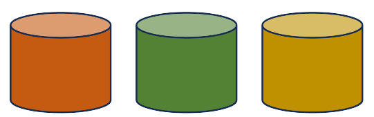
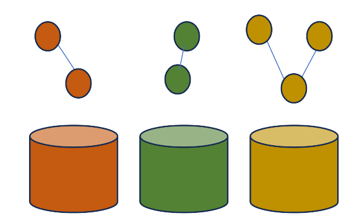
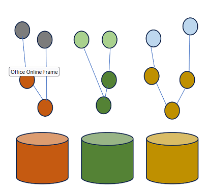
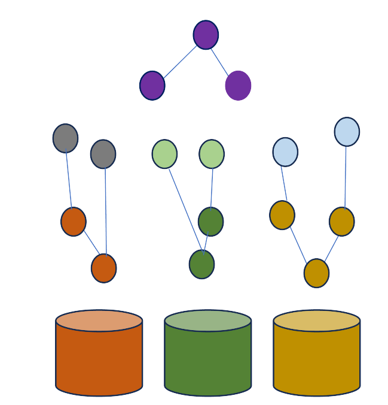
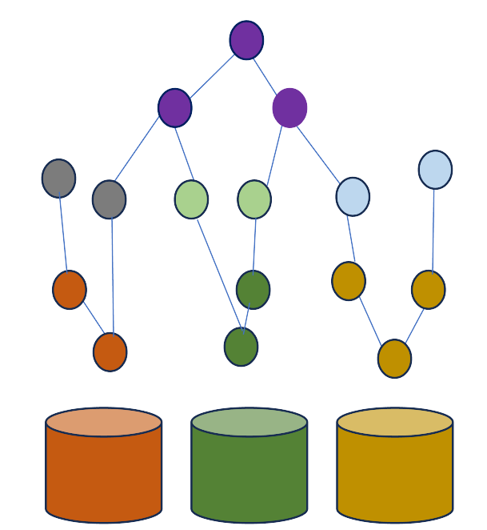
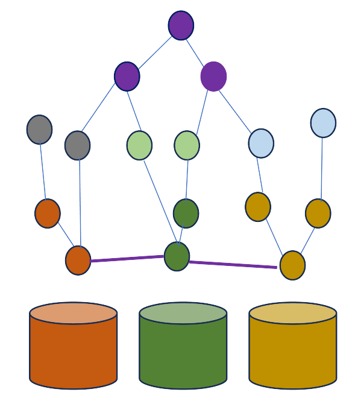

> TO DO:
> 
> - Informatiemodel voor dit project nog concreet toelichten: in dit hoofdstuk of als los
>  subhoofdstukje?
> - In het stukje informatie ingaan op: Hoe leggen we nu daadwerkelijk die koppeling tussen de
>   verschillende silo's? Gebruiken we hiervoor BSN of naam? En staat zo'n BSN dan in de URI? 
> - En wat is de rol van linksets? Dit is weer net anders dan een upper ontologie en directe
>   relaties volgens mij? Waarvoor gebruik je die?
> - Kunnen we de plaatjes wat kleiner maken?

Binnen dit project wordt uitgegaan van een Federatief Datastelsel op basis van Linked Data. Dit
hoofdstuk beschrijft wat ervoor nodig is om de verschillende registers met elkaar te koppelen. 

### Stroomlijnen van de samenhang: Informatiekundige kern in Linked Data?

// TODO waar hoort dit kopje?

De relaties tussen de registers zijn impliciet al vaak aanwezig maar wellicht houden de registers
een eigen versie bij om zo onafhankelijk te kunnen functioneren. Kadaster houdt persoonsgegevens bij
mbt eigendom van percelen. De NHR (Ubo) bevat persoonsgegevens, ANBI refereert aan KVK nummers.
Extra afspraken over de relaties kan voor vertrouwen en voor een infrastructuur zorgen waarop de
registers durven bouwen. O.a. zou dit een upper-ontologie kunnen zijn. Koppelvelden en hoe om te
gaan met deze velden plus wellicht zaken zoals versiemanagement zouden hieren afgesproken kunnen
worden.

### Onafhankelijke registers

De registers zoals BRK, BAG, NHR & BRP zijn relatief onafhankelijk van elkaar ontwikkeld door
verschillende organisaties, techniek en modellen. Zo beheert Kadaster bijvoorbeeld de BRK en de BAG
en de KvK het NHR. Ook de modellering van de gegevens kan verschillen. Zo zijn de NEN3610 en
Geonovum's IM-modellen de basis voor de datasets van Kadaster terwijl deze standaarden minder van
belang zijn bij andere registers. Abstract wordt deze situatie als volgt gevisualiseerd.

### Registers als Linked Data

De bron van alle registers is vooralsnog geen Linked Data. Een ontwikkeling naar Linked Data toe zou
kunnen door de bestaande situatie uit te breiden met een publicatie van de gegevens in Linked Data.
Hierbij publiceert elk register zijn data in LD. Door middel van een SPARQL endpoint kan er nu een
federatieve query gemaakt worden die gegevens uit meerdere endpoints raadpleegt.

TO DO: wat is ervoor nodig om LD van een gewone dataset te maken? Kunnen we daar 1-2 zinnen aan
wijden?

Om precies te weten wat de data betekent en waar evt een sleutel te vinden is die in meerdere
registers aanwezig is kan de data verrijkt worden met context. Elk data elementje kan gekoppeld
worden aan bijvooreeld een linked data klasse die o.a. beschrijvingen, labels ( in meerdere talen),
en overige informatie kan bevatten. 

Door deze extra context is de data beter te begrijpen en makkelijker te bevragen door de
gebruikers.De relatie met andere registers is nog niet optimaal in deze situatie. Idealiter zorg je
voor formele koppelelementen die de registers adopteren. Oftewel een zogenaamde upperontologie of
wellicht in FDS termen een LD versie van een ['informatiekundige
kern'](https://realisatieibds.pleio.nl/groups/view/0056c9ef-5c2e-44f9-a998-e735f1e9ccaa/federatief-datastelsel/wiki/view/d0d90aeb-c896-4925-9948-35c6615ee873/notitie-informatiekundige-kern).
Deze upperontologie of informatiekundige kern definieert de koppelvlakken en maakt de benodigde
afspraken met de registers zodat de registers en gebruikers op deze kern kunnen bouwen. 

TO DO: kunnen we een voorbeeld geven van afspraken?

De registers moeten deze upperontologie en de bijbehorende afspraken adopteren. Zo zal bijvoorbeeld
de BAG-ID uit de upperontologie zowel door de KVK NHR als door de BAG van Kadaster gebruikt moeten
worden. Daarmee is af te leiden dat deze data conceptueel dezelfde informatie is. 

Hiermee wordt het makkelijker om data uit 1 register te combineren met data uit een ander register.
Hoewel deze mogelijkheid er is door het uitvogelen van relaties tussen sleutelvelden uit de
upperontologie zou je natuurlijk ook extra relaties kunnen afleiden en deze 'materialiseren'.
Oftewel extra relaties kunnen (evt virtueel) toegevoegd worden op basis van context waarmee er dus
directe relaties ontstaan tussen de registers. 

TO DO: kunnen we hier een voorbeeld van geven? Dit is voor mij nu niet helemaal duidelijk en ook
niet wat dan precies het verschil is met de upperontologie.

De aanwezigheid van directe relaties tussen de registers maakt het nog makkelijker om federatieve
bevragingen te doen. Integrale bevragingen zijn hierbij mogelijk maar ook bevragingen mbt
consistentie zijn hierbij zeer makkelijk. Denk bijvoorbeeld aan de vraag welke BAG-Panden zijn
onbekend bij Kadaster vanuit de NHR, Of vanuit de BRK, welke BRP personen zijn (on)bekend bij de
BRP. Het schrijven van een dergelijke query is zeer eenvoudig. De uitvoering ervan zal natuurlijk
qua performance wel het nodige vereisen.

