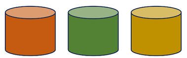

Een kernprincipe bij de ontwikkeling van het federatief datastelsel is het concept van een informatiekundige kern. Deze informatiekundige kern ondersteunt het koppelen van eerder verspreide basisregistraties via een set vooraf gedefinieerde relaties (zie [Stelsel van Basisregistraties](https://www.digitaleoverheid.nl/overzicht-van-alle-onderwerpen/stelsel-van-basisregistraties/stelsel-van-basisregistraties-toegankelijke-beschrijving/)). Deze geïdentificeerde relaties vertegenwoordigen de relaties die het meest algemeen worden gebruikt bij het combineren van gegevens uit verschillende bronnen voor een bepaald doel. Het idee is dat door deze 'kern' te formaliseren, gebruikers van de data deze informatie gemakkelijker kunnen opvragen.

Het concept van een informatiekundige kern heeft affiniteit met linked data technologies vanwege de inherente ondersteuning van laatstgenoemde voor het koppelen van gedistribueerde gegevensbronnen. Wel is het zo dat Linked Data meerdere mogelijkheden biedt voor het ondersteunen van federatieve bevragingen. Zo is het bijvoorbeeld zeer goed mogelijk om meerdere bronnen federatief te bevragen zonder dat er een expliciete koppeling is tussen de bronnen. Wel moet er natuurlijk een gemeenschappelijke data-element zijn om te kunnen verbinden: denk hierbij aan Naam, Adres, BagID, KVK nummer, BSN, etc. Nadat het element in een ander gevonden is (bijvoorbeeld een sparql query om een Persoon op te halen in de BRP op basis van Naam, geboortedatum, etc) kan er een directe link gelegd worden. Daarmee wordt het makkelijker om federatief te bevragen.

Ook biedt Linked data mogelijkheden om onafhankelijke datasets 'achteraf' te koppelen. Door bijvoorbeeld de datasets te voorzien van extra context op basis van gestandardiseerde ontologieën zoals RDFS, OWL en SHACL kunnen de bestaande datasets verrijkt kunnen worden met nieuwe data. Deze nieuwe data kan ook leiden tot koppelingen tussen de gedistribueerde gegevensbronnen. 

Omdat het startpunt voor het Lock-Unlock project de doorontwikkeling van het IGO project was, was het gebruik van linked data technologie logisch voor dit project. Hoewel het project deze technologieën gebruikt om gegevensbronnen te koppelen is Linked Data technologie niet de enige manier voor federatieve bevragingen. Andere oplossingen zijn echter niet verder onderzocht of getest als onderdeel van dit project.

De volgende discussie presenteert twee opties voor het ontwerp van een informatiekundige kern met behulp van linked data technologie. Eén van deze opties wordt vervolgens meegenomen in het ontwerp van het informatiemodel voor dit project. Het is belangrijk op te merken dat, hoewel het informatiemodel en het gebruik ervan binnen dit project, de toegevoegde waarde aantoont van geformaliseerde relaties voor het ondersteunen van federatieve bevraging tussen informatiebronnen, het geen definitieve conclusies biedt over wat de inhoud van de informatiekundige kern zou moeten zijn. Dit komt omdat de gegevens die voor dit project werden gebruikt, aanzienlijk zijn vereenvoudigd om te voldoen aan de minimale vereisten van de ontworpen demonstrator. Elk onderzoek naar de uitdagingen en randgevallen die van invloed zijn op de complexiteit van het ontwerp van een informatiekundige kern viel buiten de scope van dit project.

### Federatief Datastelsel als Linked Data
Er zijn een aantal stappen die moeten worden genomen bij het ontwikkelen van een federatief datastelsel met behulp van linked data. Eén van deze stappen omvat de definitie van de informatiekundige kern. 

#### Stap 1. Onafhankelijke Registers 
 
De basisregistraties (e.g. BRK, BAG, BRP en NHR) zijn relatief onafhankelijk van elkaar ontwikkeld door verschillende organisaties, techniek en modellen. Zo beheert Kadaster bijvoorbeeld de BRK en de KvK het NHR. Ook de modellering en standardisatie van de gegevens kan verschillen. Zo zijn, bijvoorbeeld, de NEN3610 en Geonovum's IM-modellen de basis voor de datasets van Kadaster terwijl deze standaarden minder van belang zijn bij andere registers. Door de onafhankelijke ontwikkeling van registers ontstaan zogenaamde data silo’s. Abstract wordt deze situatie als volgt gevisualiseerd. 

| |
| :--: |
|*Registraties als losstaande silo's*|

#### Stap 2. Registers als Linked Data

De bron van alle registers is vooralsnog geen Linked Data. Een ontwikkeling naar Linked Data toe zou kunnen door de bestaande situatie uit te breiden met een publicatie van de gegevens in Linked Data. Er zijn steeds meer implementaties en standaarden aanwezig om Linked Data te genereren vanuit een andere type bron zoals bijvoorbeeld een SQL database. Denk hierbij bijvoorbeeld aan [RML](https://rml.io/) of [R2RML](https://www.w3.org/TR/r2rml/). Ook maakt [JSON-LD](https://www.w3.org/TR/json-ld11/) de stap naar Linked Data wat makkelijker voor implementaties die werken met JSON denk bijvoorbeeld aan JSON api's. Het volgende diagram toont de creatie van Linked Data 'silo's voor elk van de oorspronkelijke gegevensbronnen.

||
| :--: |
|*Registraties beschikbaar gemaakt als Linked Data*|

> **4 Star Linked Data:** Omdat deze informatie nu als Linked Data wordt gepubliceerd met behulp van de verschillende open Linked Data-standaarden, kan deze informatie worden beoordeeld volgens het [5-sterrenmodel](./linkeddata.md#basis-principes). Op dit moment worden de individuele Linked Data-silo's beoordeeld als 4-sterren Linked Data. De volgende stappen in deze sectie verbeteren deze beoordeling.

Door middel van een SPARQL endpoint kan er nu een federatieve query gemaakt worden die gegevens uit meerder endpoints raadpleegt. Om dit te kunnen doen, moet de gebruiker echter begrijpen waar de overlappingen bestaan tussen verschillende datasets, d.w.z. hoe de informatie die zich in deze zich bevindt moet worden verbonden om de informatie over verschillende endpoints te kunnen opvragen.

#### Stap 3. Formele Verbinding van Registers

Om precies te weten wat de data betekent en waar evt een overlap te vinden is die in meerdere registers aanwezig is, kan de data verrijkt worden met een context. Elk data element (of stuk instantie data) kan gekoppeld worden aan een linked data klasse (bv. een `owl:Class`) die o.a beschrijvingen, labels (in meerdere talen), en overige informatie kan bevatten. Door deze extra context is de data beter te begrijpen en makkelijker te bevragen door de gebruikers. 

||
| :--: |
|*Beschikbaar maken van een context*|

De toevoeging van een dergelijke context verschijnt in de vorm van of een schema dat is gedefinieerd met behulp van Linked Data-standaarden of in de vorm van een geformaliseerde ontologie. Dit laatste is alleen beschikbaar als de context formele logica omvat (bijvoorbeeld het gebruik van axioma's) die [inferencing](https://www.ontotext.com/knowledgehub/fundamentals/what-is-inference/) ondersteunt.

Met de toevoeging van een schema of ontologie aan de instantiegegevens kan de overlap tussen verschillende registers voor gebruikers gemakkelijker te identificeren zijn. Dit kan gebaseerd zijn op het gebruik van dezelfde klassen of attributen in meerdere registers (bijvoorbeeld de aanwezigheid van BSN-nummers in zowel de BRK als de BRP) of op de mogelijkheid om geospatiale overlap tussen objecten uit te voeren. Dit laatste is vaak nuttig bij het identificeren van de relatie tussen georuimtelijke registers zoals de BAG en de BRK, waar de overlap tussen gebouwen en percelen voor veel gebruikers nuttig is.

Omdat deze overlappingen of schijnbaar gedeelde kenmerken nog niet als zodanig tussen registers zijn geformaliseerd, moeten deze door gebruikers worden geïdentificeerd en onderzocht voordat een federatieve query kan worden uitgevoerd. De relatie met andere registers is dus nog niet optimaal in deze situatie. 

Idealiter zorg je voor formele koppelelementen die de registers adopteren en onderhouden. De geformaliseerde koppelelementen komen in twee vormen voor, of in de vorm van een **upperontologie**, of in de vorm van **gematerialiseerde relaties** tussen instantiegegevens over verschillende registers heen. Beide worden hieronder beschreven en sluit elkaar niet uit.

> **5 Star Linked Data:** Wanneer één of beide van deze opties tussen basisregistraties worden geïntroduceerd, kunnen deze registers nu worden beoordeeld als 5-sterren linked data.

##### Optie 1: Upperontologie
Een upperontologie, of
wellicht in FDS termen een Linked Data versie van een ['informatiekundige
kern'](https://realisatieibds.pleio.nl/groups/view/0056c9ef-5c2e-44f9-a998-e735f1e9ccaa/federatief-datastelsel/wiki/view/d0d90aeb-c896-4925-9948-35c6615ee873/notitie-informatiekundige-kern), definieert klassen en/of attributen die worden gedeeld tussen verschillende registers. Een upperontologie zou bijvoorbeeld het attribuut BSN-nummer kunnen definiëren als het identificatienummer van een persoon en zowel de BRP als de BRK kunnen dit attribuut gebruiken bij het publiceren van identificatiegegevens gerelateerd aan personen. Deze gedeelde kenmerken kunnen worden aangeduid als sleutelvelden. 

||
| :--: |
|*Upperontologie beschikbaar gemaakt voor een bepaald set registers*|

Een dergelijke upperontologie kan logisch worden gedefinieerd op basis van geïdentificeerde sleutelvelden maar om dit op een nuttige manier te kunnen implementeren voor gebruikers moeten de registers deze upperontologie en de bijbehorende afspraken ook adopteren. Door in beide registers hetzelfde attribuut te gebruiken dat in de upperontologie is gedefinieerd, kunnen gebruikers van deze gegevens er zeker van zijn dat het BSN-nummer in beide registers op dezelfde manier wordt gebruikt. Wanneer een identifier in het ene register overeenkomt met een identifier in een ander register dan weet je zeker dat deze verwijst naar dezelfde persoon in de BRP.

||
| :--: |
|*Linked data registers gecombineerd door het gebruik van een upperontologie*|

Hiermee wordt het makkelijker om data uit één register te combineren met data uit een ander register. Bij het schrijven van een federatieve query kan dit BSN-nummer dus worden gebruikt om informatie over de percelen van een bepaalde persoon op te halen bij de BRK en de persoonsgegevens van deze persoon (bijvoorbeeld volledige naam, geboortedatum en huwelijksstatus) uit de BRP te halen. 

##### Optie 2: Gematerialiseerde Relaties 
Hoewel deze mogelijkheid er is door het uitvogelen van relaties tussen sleutelvelden uit de upperontologie zou het ook mogelijk zijn om extra relaties te kunnen afleiden en deze 'materialiseren'. Oftewel extra relaties kunnen (evt virtueel) toegevoegd worden. Deze materialisatie van relaties wordt niet gedefinieerd door de upperontologie maar tussen de instantiegegevens in de registers zelf.

||
| :--: |
|*Materialiseren van extra relaties tussen registers*|

Het materialiseren van relaties tussen registers is in verschillende scenario's logisch. Een voorbeeld is het formaliseren van relaties tussen registers op basis van hun ruimtelijke relatie met elkaar. Bijvoorbeeld de relatie tussen een `bag:Verblijfsobject` en de `brk:Perceel` waaraan dit object gerelateerd is op basis van zijn ruimtelijke nabijheid (overlappende geometrie bijvoorbeeld). In de praktijk kan de gebruiker door de introductie van deze geformaliseerde relatie zien welke `bag:Verblijfsobjecten` bij een bepaald `brk:Perceel` horen, maar bij uitbreiding ook welke adressen (`bag:Nummeraanduiding`) bij het perceel horen.

Een tweede voorbeeld is de materialisatie van relaties tussen instantiegegevens op basis van attributen vastgelegd in de upperontologie. Stel Kadaster legt eigendom van percelen van rechtspersonen vast met o.a. een `kadaster:KVKnummer`. Indien dit `kadaster:KVKnummer` als kenmerk gelijk gesteld wordt aan een KVKnummer in de upperontologie die vervolgens ook gelijkgesteld is aan `NHR:InschrijvingsNummer` dan zou je vanuit kadaster Percelen een directe relatie kunnen leggen naar een NHR inschrijving. Hiermee ontstaan er dus directe relaties tussen de registers. 

De aanwezigheid van directe relaties tussen de registers maakt het nog makkelijker om federatieve bevragingen te doen. Integrale bevragingen zijn hierbij mogelijk maar ook bevragingen mbt consistentie zijn hierbij zeer makkelijk. Denk bijvoorbeeld aan de vraag welke BAG-Panden zijn onbekend bij Kadaster vanuit de NHR, of vanuit de BRK, welke BRP personen zijn (on)bekend bij de BRP. Deze queries geven inzicht in de consistentie van samenwerkende registers. Het schrijven van een dergelijke contorle query is zeer eenvoudig. De uitvoering ervan zal natuurlijk qua performance wel het nodige vereisen. Linked Data technologie maakt de introductie van deze directe relaties tussen instantiegegevens eenvoudig en illustreert een duidelijk voordeel van het gebruik van deze technologie ter ondersteuning van federatieve bevragingen.

### Ontwerp van de Informatiekundige Kern als Linked Data
Het ontwerp van de informatiekundige kern in Linked Data zou zowel de upperontologie moeten omvatten als ook afspraken over de gematerialiseerde relaties tussen basisregistraties waar logische relaties bestaan. Er moeten afspraken worden gemaakt tussen de beheerders van de basisregistraties bij het ontwerpen van een dergelijke hogere ontologie en bij het onderhouden van eventuele gematerialiseerde relaties tussen de basisregistraties. Door ervoor te zorgen dat deze afspraken worden nageleefd, kan de gebruikerstoegankelijkheid en herbruikbaarheid van de basisregistraties als datastelsel worden gewaarborgd.
 
In de volgende secties worden de ingrediënten geïntroduceerd voor de testopstelling die is gedefinieerd binnen het Lock-Unlock project. Hierbij wordt een kleiner, fictief systeem van basisregistraties gecreëerd, relaties tussen informatie bronnen wordt gedefinieerd en federatieve bevragingen worden ondersteund. In de volgende sectie worden de ontwerpkeuzes besproken die zijn gemaakt bij het definiëren van relaties tussen informatiebronnen.

