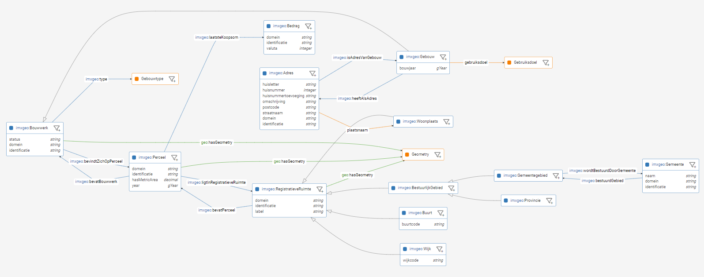
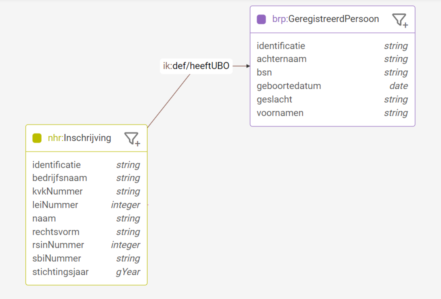

Versimpelde testdata van een federatief data stelsel is ontwikkeld op basis van Linked Data en de Linked Data gedachte. Hiermee is het mogelijk om een realistische situatie na te kunnen bootsen waarin informatie afgeschermd dient te worden. Aangezien het heel handig is om data in een context te plaatsen (denk aan data schema's) is er binnen dit project een set van schema's ontwikkeld die de registers nabootsen (versimpeld en fictief) en natuurlijk een bijbehorende dataset. Deze pagina beschrijft het maken van de schema's die relevant zijn voor dit project en de [volgende sectie](./testopstelling.md) beschrijft het maken van gerelateerde dataset. 

### Vereenvoudigd Conceptueel Model 
Om een federatieve bevraging te kunnen laten zien en om daarmee te kunnen onderzoeken, is een testopstelling nodig. De eerste stap in deze testopstelling is het maken van een conceptueel model om de benodigde gegevens voor ons doel te modelleren. Om een logische begin te maken, hebben we daarvoor gekozen voor een situatie 'dicht bij huis'. Bij het Kadaster: De Basisregistratie Kadaster, afgekort de **BRK**. 

Dit begint met het opnemen van percelen als object binnen een conceptueel model en vervolgens is het eigendom vastgesteld via `Tenaamstellingen` aan objecten personen. et personen worden `Rechtspersonen` bedoeld, wat een echt of 'natuurlijk' persoon kan zijn, maar ook een bedrijf. De juridische term is `Natuurlijk Persoon` voor echte mensen, welke geregistreerd zijn in de Basisregistratie Personen, afgekort met de **BRP**. Bedrijven zijn juridisch `Niet Natuurlijke Personen` en deze zijn geregistreerd in het Nationaal Handelsregister, afgekort met **NHR**. Om de casus nog wat breder te maken hebben we ook nog het **ANBI** register toegevoegd; het register van de Belastingdienst waarin goede doelen staan die aangemerkt zijn als Algemeen Nut Beogende Instellingen.

||
| :--: |
|*Informatie Model IMXGeo als Linked Data*|

Het vereenvoudigd conceptueel model van bovenstaande tabel gebaseerde visualisatie is verder uitgewerkt in een Linked Data als een (upper)ontologie voor Lock-Unlock Informatiemodel gebaseerd op losstande schemas. Om de schemas en (upper)ontologie te modelleren is er gebruik gemaakt van de RDF/RDFS/OWL en SHACL standaarden. 

### Losstaande Schema's per Silo

Voor elke silo is een schema gemaakt. Het betreft hier een (over) versimpelde schema dat grofweg de kern van de register bevat met als doel R&D voor de dit project te ondersteunen en tevens voor demonstratie mogelijkheden. De schema voor elke silo heeft een eigen namespace en is relatief onafhankelijk gemodelleerd. Zo is voor Kadaster de NEN3610 een belangrijke upperontologie terwijl dit wellicht voor de BRP niet zo hoeft te zijn. Op deze manier onstaat er een situatie dat elk register een eigen ontologie heeft op basis van eigen upperontologieën.

#### IMX-Geo Schema
Een openbare basis dataset is IMX-Geo. Deze is aanwezig als Linked Data en bevat data van gebouwen en percelen liggende in registratieve ruimtes. Bijna alle gegevens zijn openbaar. De 'laatste koopsom' is wellicht een uitzondering hierop. Het deel van het informatiemodel dat nodig is voor Lock Unlock wordt gevisualiseerd in de volgende afbeelding en is [hier](https://data.labs.kadaster.nl/lock-unlock/informatie-model/schema?f=http%3A%2F%2Fmodellen.geostandaarden.nl%2Fdef%2Fimx-geo%23) te vinden:

||
| :--: |
|*Informatie Model IMXGeo als Linked Data*|

IMX-Geo is vanuit Kadaster beschikbaargesteld in Linked Data en is grofweg voor het 'Kadaster gedeelte' helemaal compleet aanwezig. Deze dataset is gebruikt in dit project.

#### BRK (Gesloten Deel) Schema
Een versimpeld model van de BRK is ontwikkeld in Linked data voor dit project. Hieronder is een screenshot van het model zichtbaar en is ook [hier te vinden](https://data.labs.kadaster.nl/lock-unlock/informatie-model/schema?f=https%3A%2F%2Fdata.labs.kadaster.nl%2Flock-unlock%2Fbrk%2Fdef%2F).

||
| :--: |
|*BRK Schema als Linked Data*|

#### NHR Schema
Een versimpeld model van de NHR is gemaakt. Inschrijvingen bevatten wat basis gegevens en is gekoppeld aan de openbare Registratieve Ruimtes. Hieronder is een diagram van het NHR schema te zien en is [hier live te vinden](https://data.labs.kadaster.nl/lock-unlock/informatie-model/schema?f=https%3A%2F%2Fdata.federatief.datastelsel.nl%2Flock-unlock%2Fnhr%2Fdef%2F).

||
| :--: |
|*NHR Schema als Linked Data*|

#### BRP Schema
Een versimpelde versie van het BRP register is gemodelleerd. Hieronder is een diagram van het BRP schema te zien en is [hier live te vinden](https://data.labs.kadaster.nl/lock-unlock/informatie-model/schema?f=https%3A%2F%2Fdata.federatief.datastelsel.nl%2Flock-unlock%2Fbrp%2Fdef%2F). 

||
| :--: |
|*BRP Schema als Linked Data*|

#### ANBI Schema
Hieronder is een diagram van het ANBI schema te zien. Dit sluit niet precies op de ANBI informatie model zelf en is alleen voor dit project gemodelleerd. Een live versie van de schema is ook [hier te vinden](https://data.labs.kadaster.nl/lock-unlock/informatie-model/schema?f=https%3A%2F%2Fdata.federatief.datastelsel.nl%2Flock-unlock%2Fanbi%2Fdef%2F).

||
| :--: |
|*BRP Schema als Linked Data*|

### Samenhang Creëren

De schemas en de data van de schemas zijn als silo's opgezet. Elk register publiceert zijn data en de bijbehorende context (schemas) op een eigen triplestore. 

> NB: De bovenstaanden schemas wordt hier niet gedefinieerd als ontologieën omdat ze geen axioma's of geformaliseerde inferentie regels bevatten. Met de introductie van `owl:sameAs` vanaf nu, kunnen we nu inferentie doen en nu wordt het informatie model een ontologie. Dit komt omdat deze relatie aangeeft dat er enige conceptuele gelijkenis bestaat tussen individuen en dat informatie kan worden afgeleid op basis van de aanwezigheid van deze relaties. 

Om de verschillende schema's met elkaar te verbinden, wordt een upperontologie gedefinieerd die twee relaties omvat tussen klassen die in de schema's zijn gedefinieerd, `owl:sameAs` en een `ik:heeftUBO` relatie. In beide gevallen worden deze relaties gedefinieerd als onderdeel van een hogere ontologie en gematerialiseerd in de data zelf om instanties met elkaar te verbinden. 

#### `owl:sameAs`
Door middel van `owl:sameAs` relaties kunnen individuals in Linked Data gelijk verklaard worden over verschillende siloes heen.
Oftewel een linked data resource (element) dat leeft in 1 register wordt gelijk verklaard aan een andere resource dat zich bevindt in een ander register (zie hieronder).

||
| :--: |
|*Netwerk van schemas*|

De bijbehorende inference is dat alle gegevens van de 2 gelijk gestelde resources gekopieerd mag worden. Stel individual 'A' is gelijk (owl:sameAs) aan individual 'B' dan kunnen alle relaties en kenmerken gekopieerd worden van 'A' naar 'B' en andersom. Hierdoor ontstaan netwerken van linked data over de registers heen en kan er daadwerkelijk "doorgebrowsed" worden van het ene register naar het andere. Ook Sparql queries kunnen hier makkelijk gebruik van maken om zoekopdrachten over meerdere registers te uit te voeren. Ook in onze test opstelling maken we gebruik van `owl:sameAs` om relaties te leggen naar andere registers zonder volledig afhankelijk te worden van deze registers. Dit is natuurlijk een manier om de relaties te leggen. Er zijn meerdere manieren op registerdata te koppelen via Linked Data.

**Voorbeeld: BRK naar BRP en NHR**

'Personen' uit de BRK kunnen gelijk verklaard worden met 'geregistreerde personen' uit de BRK of 'Inschrijvingen' uit de NHR (Zie diagram hieronder).

||
| :--: |
|*Relatie tussen BRK, BRP en NHR registers*|

Een `owl:sameAs` relatie kan gelegd worden wanneer je weet dat deze 2 individuals ook daadwerkelijk gelijk zijn (refereert naar dezelfde persoon in de werkelijkheid). Vanuit Kadaster zal er waarschijnlijk akte informatie gebruikt worden zoals voornamen, achternaam, geboortedatum, geboortestad, etc om de juiste persoon in de BRP te vinden. De eigen adminstratie (BRK:Persoon) wordt dan gelijk verklaard met de gevonden (BRP:GeregistreerdPersoon). Ook voor relaties met de NHR werkt dit ongeveer hetzelfde. Akte informatie zal gebruikt worden om de juiste Inschrijving te vinden in de NHR om vervolgens weer de owl:sameAs relatie te leggen.

**Voorbeeld: ANBI naar NHR**
De ANBI dataset kan direct gekoppeld worden aan NHR Inschrijvingen (zie diagram hieronder).

||
| :--: |
|*Relatie tussen ANBI en NHR registers*|

#### `ik:heeftUBO`
De `ik:heeftUBO` relatie is specifiek gedefinieerd om de relatie tussen individuen in de NHR en de BRP te ondersteunen. In dit geval was het niet voldoende om een `owl:sameAs` relatie in te voeren, omdat er geen gedeelde identifier (zoals een BSN-nummer) aanwezig was en er dus op basis van deze nieuwe relatie twee verschillende identificerende attributen aan elkaar gerelateerd moesten worden. In de context van dit project werden geen axioma's gedefinieerd, dus er is geen gevolgtrekking mogelijk op basis van de aanwezigheid van deze relatie, maar dit zou indien nodig in toekomstige iteraties van het model kunnen worden geïntroduceerd.

**Voorbeeld: NHR naar BRP**

Net zoals de BRK linkt naar personen in de BRP kan ook de NHR direct verbonden worden met BRP (Geregistreerde)Personen (zie diagram hieronder).

||
| :--: |
|*Relatie tussen NHR en BRP registers*|

## Hét Informatiemodel voor Lock-Unlock
Door de `owl:sameAs` relatie (en bijbehorende inferentie) en `ik:heeftUBO` relatie ontstaat er een netwerk van samenhangende schema's. Dit kan natuurlijk als 1 schema gepresenteerd worden. 

Hieronder een screenshot van de visualisatie direct uit de data van de schema's. Deze visualisatie is ook live te bekijken via [deze link](https://data.labs.kadaster.nl/lock-unlock/informatie-model/schema).

||
| :--: |
|*Hèt Informatie Model voor Lock-Unlock*|

In dit samengesteld model zijn verschillende kleuren gebruikt om de individuele silo's (weer) te onderscheiden.
