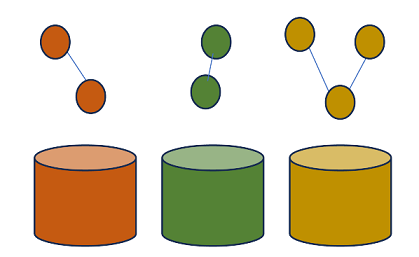
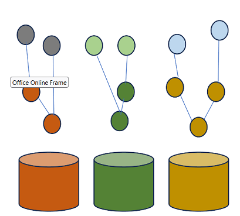
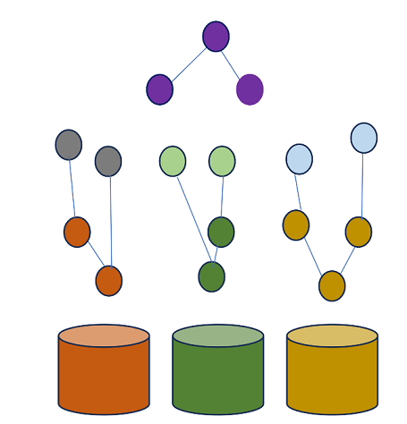

#introductie
Binnen dit project wordt uitgegaan van een Federatief Datastelsel op basis van Linked Data. Dit hoofdstuk beschrijft een mogelijke toekomst voor FDS die o.a. ook afscherming van gegevens vraagt. 

### Onafhankelijke registers
De registers zoals BRK, BAG, het Nationaal HandelsRegister (NHR) , BRP, zijn relatief onafhankelijk van elkaar ontwikkeld door verschillende organisaties, techniek en modellen. Zo beheert Kadaster bijvoorbeeld de BRK en de BAG en de KVK het NHR. Ook de modellering van de gegevens kan verschillen. Zo is de NNE3610 en Geonovum's IM-modellen de basis voor Kadaster datasets terwijl deze standaarden minder van belang zijn bij andere registers. Abstract wordt deze situatie als volgt gevisualiseerd.

### registers als Linked Data
De bron van alle registers is vooralsnog geen Linked Data. Een ontwikkeling naar Linked Data toe zou kunnen door de bestaande situatie uit te breiden met een publicatie van de gegevens in Linked data. Hierbij publiceert elk register zijn data in LD. MBV van een sparql endpoints kan er nu een federatieve query gemaakt worden die gegevens uit meerdere endpoints raadpleegt.

Om precies te weten wat de data precies betekent en waar evt een sleutel te vinden is die in meerdere registers aanwezig is kan de data verrijkt worden met context. Elk data elementje kan gekoppeld worden aan bijvooreeld een linked data klasse die o.a. beschrijvingen, labels ( in meerdere talen), en overige informatie kan bevatten.

In deze situatie is het mogelijk voor gebruikers om de data (makkelijker) te begrijpen door de aanwezigheid van de context maar ook de data makkelijker bevraagbaar te maken. Je kunt immers de context gebruiken. De relatie met andere registers is nog niet optimaal in deze situatie. Idealiter zorg je voor formele koppel elementen die de registers adopteren. Oftewel een zogenaamde upperontologie of wellicht in FDS termen een LD versie van een ['informatiekundige kern'](https://realisatieibds.pleio.nl/groups/view/0056c9ef-5c2e-44f9-a998-e735f1e9ccaa/federatief-datastelsel/wiki/view/d0d90aeb-c896-4925-9948-35c6615ee873/notitie-informatiekundige-kern)  die de koppelvlakken definieert en benodigde afspraken maakt met de registers opdat de registers op deze kern kunnen bouwen. 

De registers moeten deze upperontologie en de bijbehorende afspraken adopteren dat o.a. leidt tot relaties tussen deze kern en de register data context. Zo zal bijvoorbeeld BAG-ID uit de upperontologie zowel door de KVK NHR als door de BAG van Kadaster gebruikt worden. Daarmee is af te leiden dat deze data conceptueel dezelfde informatie is. 

Hiermee wordt het makkelijker om data uit 1 register te combineren met data uit een ander register. Hoewel deze mogelijkheid er is door het uitvogelen van relaties tussen sleutelvelden uit de upperontologie zou je natuurlijk ook extra relaties kunnen afleiden en deze 'materialiseren'. Oftewel extra relaties kunnen (evt virtueel) toegevoegd worden op basis van context waarmee er dus directe relaties ontstaan tussen de registers. 

De aanwezigheid van directe relaties tussen de registers wordt het nog makkelijker om federatieve bevragingen te doen. Integrale bevragingen zijn hierbij mogelijk maar ook bevragingen mbt consistentie zijn hierbij zeer makkelijk. Denk bijvoorbeeld aan de vraag welke BAG-Panden zijn onbekend bij Kadaster vanuit de NHR, Of vanuit de BRK, welke BRP personen zijn (on)bekend bij de BRP. Het schrijven van een dergelijke querie is zeer eenvoudig. De uitvoering ervan zal natuurlijk qua performance wel het nodige vereisen.

