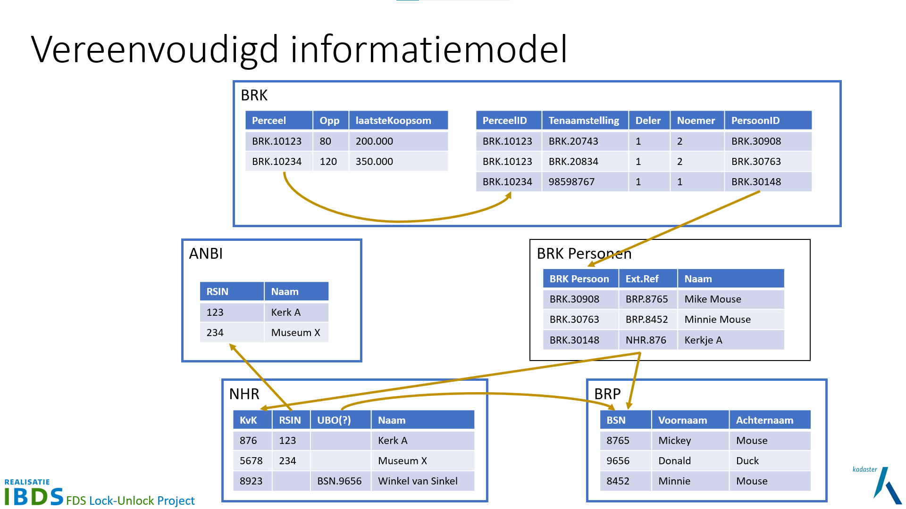
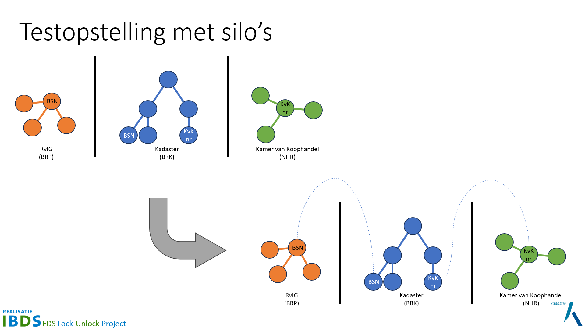

Om een federatieve bevraging te kunnen laten zien en om daarmee te kunnen onderzoeken, is een
testopstelling nodig. Daarvoor hebben we gekozen voor een situatie 'dicht bij huis' ... van het
Kadaster: De Basisregistratie Kadaster, afgekort de **BRK**. Dat start met percelen waarvan de open
data onderdelen al beschikbaar zijn in de <a href="https://labs.kadaster.nl/thema/Knowledge_graph"
target="_blank">Kadaster Knowledge Graph (KKG)</a>. Vervolgens is het eigendom vastgelegd via
`Tenaamstellingen` aan personen. Met personen worden `Rechtspersonen` bedoeld, wat een echt of
'natuurlijk' persoon kan zijn, maar ook een bedrijf. De juridische term is `Natuurlijk Persoon` voor
echte mensen, welke geregistreerd zijn in de Basisregistratie Personen, afgekort met de **BRP**.
Bedrijven zijn juridisch `Niet Natuurlijke Personen` en deze zijn geregistreerd in het Nationaal
Handelsregister, afgekort met **NHR**. Om de casus nog wat breder te maken hebben we ook nog het
**ANBI** register toegevoegd; het register van de Belastingdienst waarin goede doelen staan die aangemerkt zijn als Algemeen Nut Beogende Instellingen.

## Vereenvoudigd informatiemodel

Het vereenvoudigd informatiemodel ziet er als volgt uit:

Het vereenvoudigd informatiemodel van bovenstaande tabel gebaseerde visualisatie is verder
uitgewerkt in een Linked Data [informatiemodel](./informatiemodel.md).

## Silo's

Deze registraties bestaan in eigen silo's. Dit is geheel naar werkelijkheid ... alleen werken we voor de testopstelling met een vereenvoudigd informatiemodel. De complexiteit van volledige informatiemodellen is niet relevant
voor dit onderzoek, maar de silo's wel. Het eerste doel is het federatief kunnen bevragen over de silo's heen (zie ook [Demonstrator](./demonstrator.md))

## Testdata

Voor de verschillende silo's is synthetische testdata gegenereerd. Deze is echter wél in samenhang
gegenereerd, zodat relaties op key / index velden mogelijk is. De resultaten van de gegenereerde
testdata is vervolgens opgesplitst naar de verschillende silo's en ook als zodanig in de <a
href="https://github.com/kadaster-labs/lock-unlock-testdata" target="_blank">testdata repo</a>
toegevoegd. Deze wordt automatisch geladen bij het opstarten van de containers van de
[demonstrator](./demonstrator.md) (zie ook
[testopstelling#deployment](./testopstelling.md#deployment)).

// TODO testdata generator code in [testdata
repo](https://github.com/kadaster-labs/lock-unlock-testdata) zetten? :thinking_face:

## Deployment

Als Kadaster hebben wij de BRK data zelf in huis (uiteraard). Ook de synthetische
[testdata](#testdata) van de BRK hosten we op onze infrastructuur. Hiervoor maken we gebruik van
ons interne Managed Application Platform, een <a href="https://kubernetes.io/"
target="_blank">Kubernetes</a> / <a href="https://docs.openshift.com/" target="_blank">Open
Shift</a> en <a href="https://www.redhat.com/en/topics/devops/what-is-gitops"
target="_blank">GitOps</a> gebaseerd platform.

Voor de silo's die niet in het beheer van Kadaster zijn, te weten BRP, NHR en ANBI, zouden we die liever
willen hosten op een andere cloud omgeving. Hiervoor maken we dankbaar gebruik van de mogelijkheden
van de innovatiewerkplaats van de overheid, <a href="https://digilab.overheid.nl/"
target="_blank">Digilab</a>.

Uiteindelijk ziet de deployment op basis van containers en GitOps er dan als volgt uit:

Links naar deployments:

> TO DO
>
> - Linkjes fixen -> deel moet van Digilab zijn

- BRK -> <a href="https://brk.dst.test.cloud.kadaster.nl/"
  target="_blank">https://brk.dst.test.cloud.kadaster.nl/</a>
- ANBI -> <a href="https://anbi.dst.test.cloud.kadaster.nl/"
  target="_blank">https://anbi.dst.test.cloud.kadaster.nl/</a>
- BRP -> <a href="https://brp.dst.test.cloud.kadaster.nl/"
  target="_blank">https://brp.dst.test.cloud.kadaster.nl/</a>
- NHR -> <a href="https://nhr.dst.test.cloud.kadaster.nl/"
  target="_blank">https://nhr.dst.test.cloud.kadaster.nl/</a>
